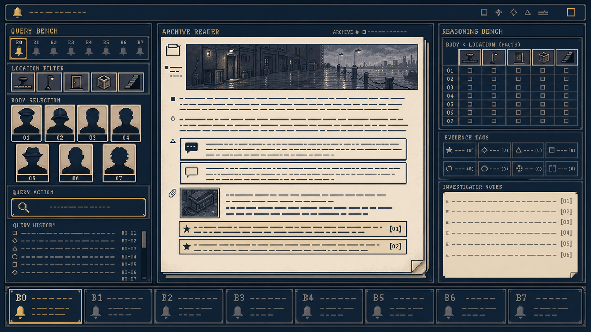
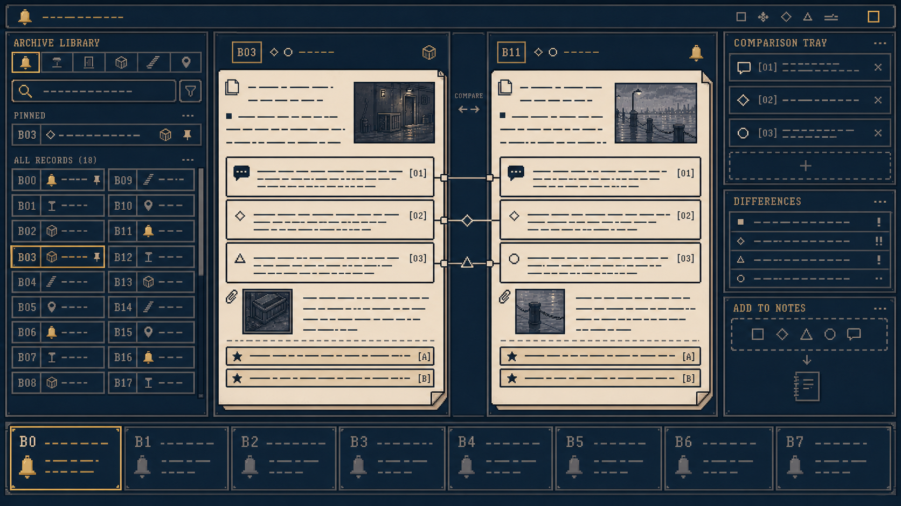
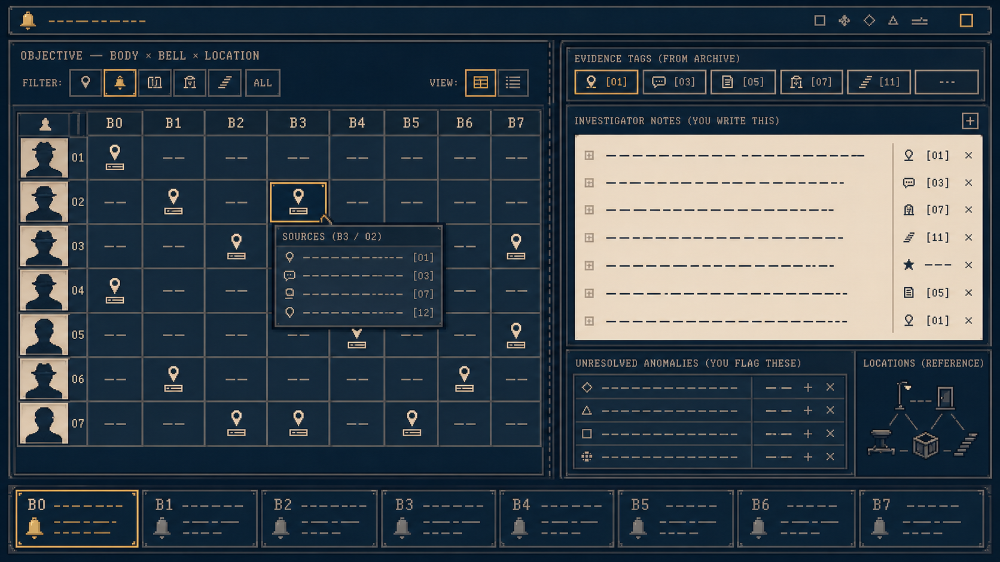
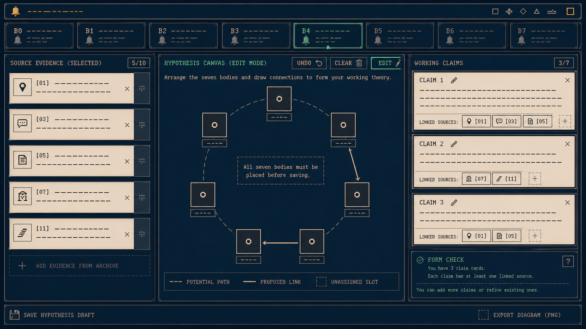
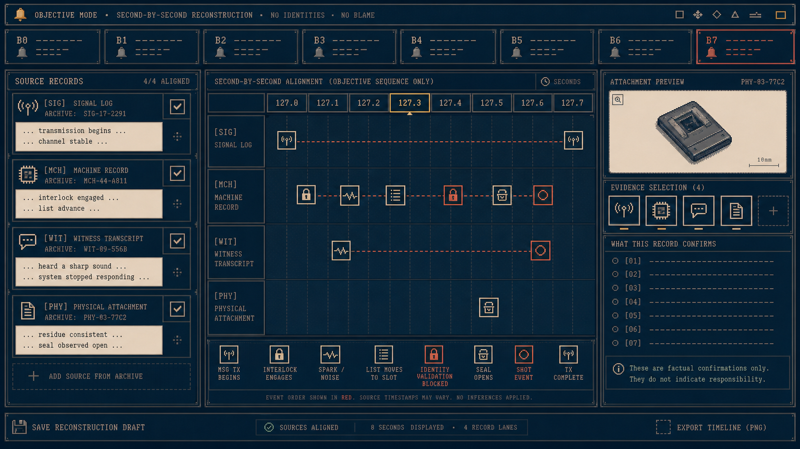
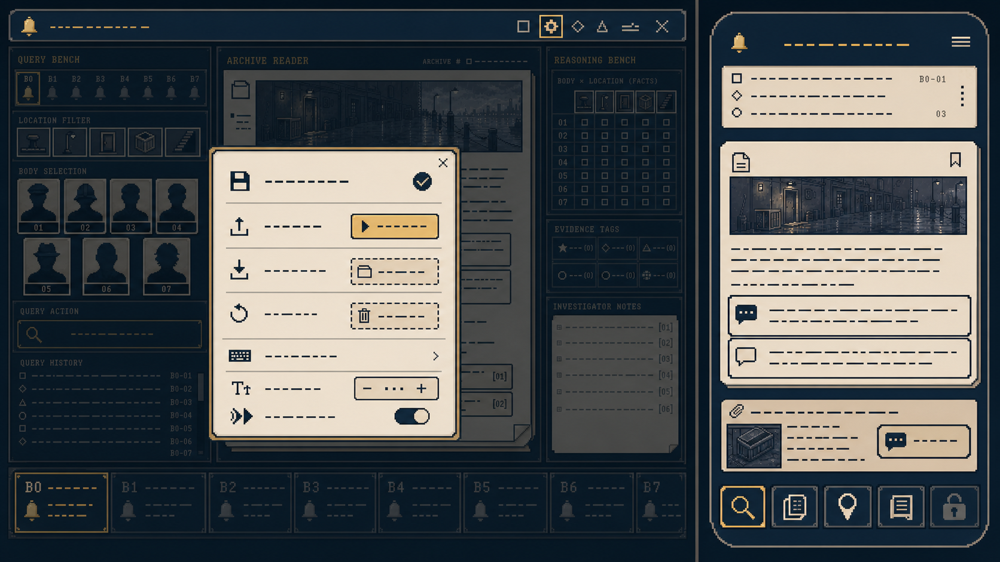

# 《黑潮钟》像素界面族：概念屏幕清单

> 版本：v1 概念验证  
> 基线：`黑潮钟_网页产品技术与制作规范_v1.md` 第 1、2、15 章  
> 目的：验证既定功能的视觉优先级；不增添世界观、角色、地点或推理答案。

## 统一原则

- 桌面端始终是 **查询—阅读—推理** 三栏工作台：24% / 48% / 28%。
- 每块像素界面按 320×180 逻辑分辨率绘制，最多 10 种功能色；正文在真实产品中仍使用高可读中文字体，概念图里的横线只是文字占位。
- B0–B3 只使用中性术语和客观记录。B4 才出现海绿的“假设”工具；它整理玩家填写内容，绝不生成身份答案。
- 朱砂红只给 B7 的客观联锁 / 秒级顺序，不美化枪击或替玩家判断责任。

## 概念屏幕

| ID | 屏幕 | 已有功能 | 关键画面目标 |
|---|---|---|---|
| S1 | 场景档案调查台（B0–B3） | 时段、地点、肉体查询；档案阅读；证据、笔记、地点表 | 让首次查询一眼可学会，正文和查询条件同时可见 |
| S2 | 档案库与双档案比较 | 已解锁档案筛选、固定、回读、双档案对照 | 让“回看旧证据”像主行为，不像隐藏设置 |
| S3 | 客观地点表与笔记 | 肉体—时段—地点事实、证据标签、自由笔记与引用 | 明确区分系统确认的地点事实与玩家写下的推断 |
| S4 | B4 假设与圆环工作台 | 身体内灵魂假设、来源档案、局部圆环提交 | 到 B4 才出现，视觉上是可撤销的工作纸而非真相仪表盘 |
| S5 | B7 秒级重建 | 多源记录对齐、固定事件顺序、附件与证据引用 | 给玩家时间对齐能力，不自动形成“谁做了什么”的结论 |
| S6 | 工具层与移动端 | 自动保存、导入 / 导出 / 重置、帮助；查询 / 档案 / 地点 / 笔记 / 假设分页 | 工具不抢调查导航，移动端不硬压三栏 |

## S1：场景档案调查台（B0–B3）

左侧只负责发起查询；中间连续阅读档案；右侧保留事实、证据和笔记。B4 前不出现任何身份交换术语或推演控件。

## S2：档案库与双档案比较

档案库的任务是让玩家主动回读、固定并比对已解锁材料；连线只表示用户选择的对照片段，不表示系统推断。

## S3：客观地点表与调查笔记

左侧表格只存档案已经确认的肉体—时段—地点事实。右侧是玩家拥有的笔记与异常标记，二者在视觉与数据上都必须分开。

## S4：B4 假设与圆环工作台

此页仅在 B4 开放。空槽、虚线与可撤销连线强调“这是玩家仍在编辑的假设”；校验只检查提交格式、证据引用和必填项，不能替玩家判定真伪。

## S5：B7 秒级重建

中间对齐多源记录，按固定客观顺序显示事件标记。红色用于顺序和联锁状态，绝不对应某个身份、动机或责任结论。

## S6：工具层与移动端

桌面工具层通过顶栏进入，不占调查一级导航。移动端为单栏分页：查询、档案、地点、笔记，以及 B4 后可用的假设；不把三栏压成不可读的窄列。

## 说明

概念图中的英文、数字和短线均为排版占位；最终实现应采用中文可读字体、真实的档案数据和可访问的文字控件。它们用于锁定层级、功能归属和像素材料感，不是最终界面资产或玩家可见剧情文本。

## 视觉验收

每张屏幕必须看得出：

1. 当前玩家能做的一件主要事情；
2. 该动作怎样回到证据、档案或笔记；
3. B4 前后有何**工具权限**变化，而不是“答案颜色”变化；
4. 像素风的材料逻辑，而非给现代仪表盘套滤镜。
