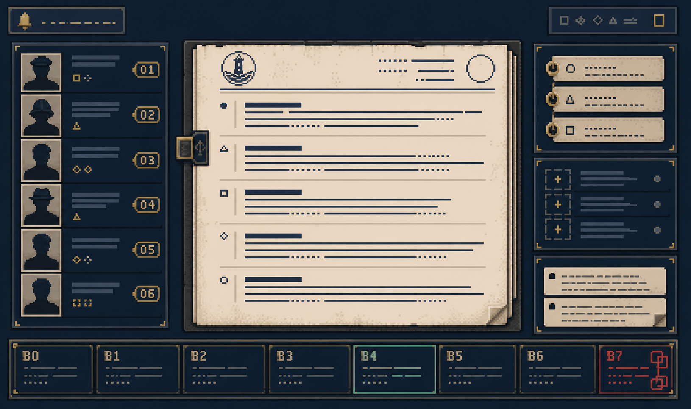

# 《黑潮钟》视觉效果参考

> 状态：界面视觉基线（v1）  
> 适用范围：档案检索、场景阅读、人物与地点表、B4 后的推演工具  
> 不包含：故事、身份结论、角色设计或地点设定的新增内容



这是一张用于验证层级、有限色像素材质和 B4/B7 状态差异的概念图，不是可直接实施的最终 UI，也不规定档案的具体文字、人物肖像或物证图片。

## 1. 设计命题

**黑潮证据室（The Black Tide Evidence Room）**：玩家面对的不是一台“神秘机器”，而是一套长期被潮气侵蚀、仍可被信任的调查档案系统。界面先让事实能被阅读，再让异常逐渐取得视觉重量。

核心气质是 **1920 年代港口机构的纪实性 + 潮湿、氧化的材料感 + 被严格限制的异常**。

## 2. 参考的提炼方式

《婆罗洲的红珍珠》可参考的是其**推理界面的信息组织**：人物入口、叙事阅读区和持续可见的时间定位能同时出现，玩家不用退出阅读才能维持案件空间感。其具体插画、角色、地图、色彩布局与任何现成资产均不使用。

| 借鉴 | 在《黑潮钟》中的原创转译 | 不借鉴 |
|---|---|---|
| 持续可见的时序定位 | 底部“钟次 / 时刻 / 场景状态”轨；B7 显示秒级客观时序 | 热带地图、水彩植物、既有地图构图 |
| 人物、物证、文本并置 | 左侧“在场肉体”，中部“档案正文”，右侧“物证与笔记” | 既有角色头像、配色和章节结构 |
| 叙事阅读优先 | 单一宽正文面，所有推理工具退居辅助层 | 让卡片、装饰或动画抢走档案阅读空间 |

## 3. 三层视觉语言

| 层 | 用途 | 材料与表现 |
|---|---|---|
| **事实层** | 已解锁档案、地点、物证、时间 | 冷白纸、铁蓝墨水、细网格、锋利但低对比的线框 |
| **工作层** | 查询条件、标签、玩家笔记、尚未验证的关联 | 深海军蓝底、可写的纸条、黄铜色焦点与虚线占位 |
| **异常层** | B4 后可见的跳变、圆环推演与机器帧 | 局部氧化绿、潮痕光晕、仅在状态改变时出现的错位双线；不得遮挡正文 |

异常层在 B0–B3 不存在。B4 初次出现时，它只改变边框、标记和相邻关系，**不以闪烁、故障字或“灵魂特效”直接替玩家下结论**。

## 4. 色彩与材质

| Token | 值 | 使用规则 |
|---|---:|---|
| `--ink-night` | `#101B22` | 页面与工作台底色，不使用纯黑大面积压迫文字 |
| `--paper-salt` | `#E9E3D4` | 档案阅读面；保留轻微纤维与褪色，不做脏旧滤镜 |
| `--ink-blue` | `#294957` | 正文、规则线和可检索数据 |
| `--brass-focus` | `#B88B45` | 键盘焦点、可操作条件与当前时间定位；每屏只作少量强调 |
| `--verdigris-anomaly` | `#4F8B83` | B4 后的异常辅助色，不代表“正确答案” |
| `--vermilion-seal` | `#9D453A` | 封缄、风险和机器联锁，仅用于高价值状态 |

纹理只允许三种：纸张纤维（阅读面）、氧化黄铜（关键物证）、受潮木材或灰泥（地点插图）。界面素材采用有限色、手工像素簇与有序抖动，而不是在矢量界面上叠加“像素滤镜”。任何纹理的目标是区分材料，不是制造噪点。

## 5. 单屏结构

桌面端默认 1440×900。阅读区必须是视觉重心，最小宽度 640px。

```text
┌──────────┬───────────────────────────────────────────────┬──────────┐
│ 在场肉体 │  档案编号 · 地点 · 时间                         │ 查询条件 │
│ 人物卡   │  ──────────────────────────────────────────── │ 物证标签 │
│ 地点入口 │  档案正文 / 对白 / 物件释义                     │ 玩家笔记 │
│          │  可见的注释、关联与来源                         │          │
├──────────┴───────────────────────────────────────────────┴──────────┤
│ 钟次 B0—B7 · 当前时段 · 已解锁场景 · B7 时显示秒级客观时序            │
└─────────────────────────────────────────────────────────────────────┘
```

移动端顺序为：档案正文 → 钟次轨 → 查询与物证 → 人物与地点 → 笔记。不能以横向滚动替代阅读。

## 6. 关键效果规格

| 状态 | 视觉反馈 | 时长 | 禁止事项 |
|---|---|---:|---|
| 查询条件加入 | 黄铜细线从输入槽延至条件筹码，筹码落位 | 160ms | 弹跳、强发光、全屏转场 |
| 新档案解锁 | 纸张从 98% 缩放回 100%，编号与来源先出现 | 180ms | 预览关键内容、用颜色暗示身份 |
| B4 机制开放 | 工作台边框出现一条氧化绿的第二规则线，圆环入口从“未校准”变为可操作 | 240ms，一次性 | 灵魂名称、人物意图或正确矩阵的自动显现 |
| B7 秒级帧 | 时间轨转为离散秒格；当前格是黄铜，联锁为朱砂红，发送完成保留为冷白 | 无自动播放 | 把枪击做成动作场面、颠倒既定顺序 |

全部动画支持 `prefers-reduced-motion: reduce`：保留状态改变，取消位移与淡入。

## 7. 字体与信息密度

- 档案正文：宋体类衬线字；`20px / 1.8`，行宽 28–34 个汉字。
- UI、地点与人物索引：系统中文无衬线；`14–16px / 1.45`。
- 编号、钟次、时间与物证编码：等宽字；数字必须等宽。
- 不把正文做成打字机逐字输出；玩家需要检索、对照和反复阅读。

## 8. 反模式

- 不做全屏旧纸滤镜、全局颗粒、故障闪烁或持续海浪动画。
- 不把像素风当作复古滤镜；边框、图标、肖像轮廓和物件缩略图须按低分辨率网格单独绘制。
- 不把青绿、红色或人物头像用作灵魂身份的编码。
- 不使用新艺术、奢靡 Art Deco 或赛博霓虹覆盖港口行政机构的克制感。
- 不复制《婆罗洲的红珍珠》或其他参考作品的角色、地图、文本、图标、布局比例或插画笔触。

## 9. 概念图验收点

生成的概念图应一眼读出：**中间是一份可认真阅读的档案；底部是不可忽略但不抢戏的钟次轨；两侧是调查工具；异常只作为第二层证据。**

若画面被装饰边框、泛黄滤镜、复杂地图或炫目的异常效果占据，即判定不通过。
