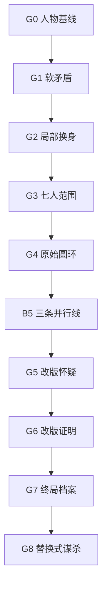

# 《黑潮钟》场景档案与证据依赖 v1.1

> 上位基线：《黑潮钟》完整游戏策划 v1.1、《黑潮钟》身体—时段—地点矩阵 v1.1  
> 本文用途：把 B0–B7 的 35 组物理场景转化为可查询的核心档案包，并规定公平推理、解锁依赖与机制揭示顺序  
> 约束：不改变既定地点矩阵、灵魂占据矩阵、物品路径和固定结局

---

# 一、档案系统口径

## 1.1 “一组物理场景”与“一份档案包”

本作共有 35 组有人在场的物理场景。每组场景对应一个稳定的核心档案 ID，但档案包内部可以包含多种来源：

- 对话或传声抄本；
- 机器纸带与门锁记录；
- 现场照片、物品清单与封条状态；
- 当事人笔录、医疗表、译文或私人便笺；
- 后续解锁的补充页。

空置地点的机器读数不另算第 36 个物理场景；它们作为相邻设备、传动副表或后续勘验附页并入相关档案包。

## 1.2 稳定 ID 规则

格式：

```text
BT-SC-[时段]-[地点]-[序号]
```

例如：

```text
BT-SC-B4-A01
```

含义是 B4、A 档案区、第一组物理场景。ID 不包含灵魂，也不随展示标题、文本修订或解锁顺序改变。

## 1.3 玩家可见字段与作者字段

档案打开后，固定显示：

- 时段；
- 主地点；
- 在场肉体；
- 来源类型；
- 来源可靠性。

档案永不直接显示灵魂身份。作者表另行保存：

- 真实灵魂；
- 行为目标；
- 已知与误信；
- 携带物与遗留物；
- 本场在证据链中的职责。

下表中的“查询种子”是玩家在打开档案前能从其他档案推得的字段：

- `T`：时段；
- `L`：地点；
- `B`：在场肉体集合。

所有核心档案最终都可由既有证据推出 `T + L + B`，不要求盲试五地点与七肉体的组合。

## 1.4 来源可靠性

| 标记 | 来源 | 可以直接证明 | 不能直接证明 |
|---|---|---|---|
| `M` | 机器与机械日志 | 时间、开闭、设备状态、肉体凭证 | 灵魂、动机 |
| `P` | 物证与现场照片 | 物品位置、伤痕、身体限制 | 主观意图 |
| `D` | 正式文书 | 当时制度记录、签字与措辞 | 内容必然真实 |
| `T` | 对话／证词抄本 | 说了什么、谁以哪具肉体发声 | 说话者诚实或灵魂身份 |
| `N` | 私人便笺／草稿 | 书写意图、知识与语言特征 | 所述事实完整无误 |

每个核心结论至少由两种来源支撑；身份、改版和终局谋杀采用三种来源的证据三角。

---

# 二、解锁门与非线性结构

## 2.1 逻辑门

| 门 | 玩家必须已经掌握 | 解锁作用 |
|---|---|---|
| G0 基线 | 四份 B0 档案 | 进入第一次钟后记录 |
| G1 软矛盾 | 任意三份 B1 档案，且至少一份包含身体限制 | 允许查询 B2 的局部互证档案 |
| G2 局部交换 | `BT-SC-B2-J01` 加 B2 的 A／R／C 任一档案 | 玩家可正式标注“灵魂可能与肉体分离” |
| G3 七人范围 | B3-R 与 B3-H，再加 B3-A／J／C 任意两份 | 确认七具肉体均受影响，但不公开精确圆环 |
| G4 原始圆环 | B4-A、B3-C、B0-C | 开启灵魂假设表并自动演算 B1–B4 |
| G5 改版怀疑 | B6-R、B6-H、B6-A | 原始圆环与实测状态冲突，系统开放“实时版框已变”问题 |
| G6 改版证明 | G5、B4-C 补充页，并正确指出 Niko 肉体为锚点 | 自动演算 B5–B7 的六人环 |
| G7 终局进入 | G6，且枪、名单、发送带三条物证路径均已确认 | 开放 B7 的四组终局档案 |
| G8 真相提交 | B7-R、B7-A 及 B7-H／J 任一 | 提交死者灵魂、开枪者、错误信念与逃亡者 |

## 2.2 非线性但可达的主图



各阶段内部采用并行分支：

- 早期可从 A 的排字线、R 的电讯线、J 的医疗线或 C 的钟楼线进入；
- G2 不要求清空全部 B2 档案；
- B4-C 的关键补充页延迟到 B6 才可恢复，避免机制一揭示就同时暴露改版者；
- B7-H 与 B7-J 是互补的排除证据，玩家不必先读完两者才能打开 B7-R 或 B7-A，但最终高置信答案需要至少一份。

## 2.3 防软锁原则

1. 每个逻辑门至少有两条前进路径或一个系统提示。
2. 任何必需档案都不以自身结论作为前置。
3. 灵魂身份答案只用于自动演算，不作为唯一查询坐标。
4. 若玩家连续三次提交错误组合，提示缺失的字段维度，不泄露正确肉体。
5. 所有“延迟补充页”均有明确的机器恢复原因，不以作者任意封锁解释。

---

# 三、B0：钟前基线（4 组）

## BT-SC-B0-H01｜封站命令

- **在场肉体／真实灵魂**：Mara／Mara，Kovač／Kovač，Verri／Verri。
- **档案形式**：`D+M+P`，封站命令、值班台门禁册、Kovač 枪套封条照片。
- **查询种子**：开局直接可见 `T+L+B`。
- **核心线索**：建立三人的正常语言与权力关系；记录枪套封条号 `K-17`；Verri 肉体携带电讯区内信号间钥匙 `R-2`。
- **误导**：Mara 对 Verri 命令的精确复述显得像绝对服从，实际是职业习惯与胁迫关系。
- **前置／后继**：根档案；解锁 B1-A、B1-H 的坐标，建立配枪与钥匙物品线。
- **玩家应得结论**：此时三人均表现为公开身份；配枪和钥匙是随肉体携带的物品，不是随意志移动的抽象权限。

## BT-SC-B0-R01｜线路自检

- **在场肉体／真实灵魂**：Klara／Klara。
- **档案形式**：`M+T`，莫尔斯自检纸带与报务口述校验。
- **查询种子**：开局直接可见 `T+L+B`。
- **核心线索**：建立 Klara 的正常高速节奏、左手补偿动作、短句口令和长句继电器的完整状态。
- **误导**：纸带中一次重复发送看似线路故障，实际是 Klara 的“收到—重复—确认”工作法。
- **前置／后继**：根档案；解锁 B1-R；为 B2-R 的继电器破坏和 B6-R 的发送带提供基线。
- **玩家应得结论**：B0 时 R 线路能完整传递长句；以后出现截断不能归因于固有故障。

## BT-SC-B0-J01｜拘押体检

- **在场肉体／真实灵魂**：Livia／Livia，Mateo／Mateo。
- **档案形式**：`D+P+T`，体检表、手部照片、医患对话抄本。
- **查询种子**：开局直接可见 `T+L+B`。
- **核心线索**：建立 Livia 的诊断程序；Mateo 双手有排字工灼痕但无医学知识；二人对“牺牲少数保存证词”有公开冲突。
- **误导**：Mateo 的手伤容易使玩家误以为后续任何笨拙操作都源于疼痛。
- **前置／后继**：根档案；解锁 B1-J；为 B2-J 的医疗／法律双向错位与 B5-J 的死因文件提供基线。
- **玩家应得结论**：医疗技能属于 Livia 的经验，不属于医生肉体本身；Mateo 的持续目标是保存姓名与证言。

## BT-SC-B0-C01｜七钟校准

- **在场肉体／真实灵魂**：Niko／Niko。
- **档案形式**：`M+P+N`，钟楼检修簿、维护井尺寸图、七格计数草签。
- **查询种子**：开局直接可见 `T+L+B`。
- **核心线索**：建立 Niko 对钟楼与 C—A 维护井的独占路线知识；只有 Niko 肉体能通过窄井；实时版框有七个活动槽。
- **误导**：七格草签可被理解为普通钟次校准，不直接指向灵魂机制。
- **前置／后继**：根档案；解锁 B1-C、B2-C；是 G4 原始圆环和 G6 锚点证明的必要基线。
- **玩家应得结论**：路线知识与身体通过能力是两种条件；钟前实时机构确实有七个活动位。

---

# 四、B1：第一次错位（5 组）

## BT-SC-B1-A01｜私柜与暗记

- **在场肉体／真实灵魂**：Mara／Verri，Kovač／Mateo。
- **档案形式**：`M+P+T`，私柜转盘压痕、调阅签、低可信争执抄本。
- **查询种子**：`T+L` 来自第一声与 A 柜报警；`B` 由 B0-H 的离席签推得。
- **核心线索**：Mara 肉体一次打开 Verri 私柜；Kovač 肉体辨认地下排字暗记，并把一张倒置铅字摆正。
- **误导**：Mara 曾受雇于 Verri，可能见过密码；港警查禁地下印刷物，也可能学过暗记。
- **前置／后继**：前置 B0-H；后继 B2-A、B2-R。
- **玩家应得结论**：两具肉体都表现出不属公开身份的独占知识，但单场不足以确认换身。

## BT-SC-B1-R01｜不会发报的报务员

- **在场肉体／真实灵魂**：Klara／Mara。
- **档案形式**：`M+T`，失败发送纸带与法律警告口述稿。
- **查询种子**：`T+L+B` 由 B0-R 的连续值守记录直接给出。
- **核心线索**：Klara 肉体写出 Mara 独有的法律措辞，却无法复现 B0 的高速手法；停顿位置像口译分句而非报码分组。
- **误导**：可解释为 Klara 抄写 Mara 的模板，或暴雨造成线路节奏失常。
- **前置／后继**：前置 B0-R；后继 B2-R、B2-J。
- **玩家应得结论**：身体权限仍在，但专业技能与语言习惯似乎不在原处。

## BT-SC-B1-J01｜敲击与遗物

- **在场肉体／真实灵魂**：Livia／Klara，Mateo／Niko。
- **档案形式**：`P+T+D`，病床刮痕节奏、家属遗物登记、互相试探抄本。
- **查询种子**：`T+L+B` 由 B0-J 的拘留状态和门封给出。
- **核心线索**：Livia 肉体无意识敲出 Klara 的报码节奏；Mateo 肉体认出只与 Niko 家庭有关的遗物。
- **误导**：敲击可被解释为焦虑；Mateo 长期搜集受害者姓名，可能见过遗物记载。
- **前置／后继**：前置 B0-J；后继 B2-J、B2-A。
- **玩家应得结论**：技能与关系记忆同时出现错位，但仍需排除串供或秘密调查。

## BT-SC-B1-C01｜少年的专业包扎

- **在场肉体／真实灵魂**：Niko／Livia。
- **档案形式**：`P+N`，包扎现场照片与检修簿边缘的脉搏记录。
- **查询种子**：`T+L+B` 由钟楼连续检修名册给出。
- **核心线索**：Niko 肉体正确判断旧伤与脉搏；专业步骤无误，但短小手指使结扎方式改变。
- **误导**：Livia 可能曾教过 Niko 急救；学徒在危险岗位掌握包扎并非不可能。
- **前置／后继**：前置 B0-C；后继 B2-C、B2-J。
- **玩家应得结论**：知识表现像 Livia，但执行结果仍受 Niko 肉体限制。

## BT-SC-B1-H01｜专员的警务口令

- **在场肉体／真实灵魂**：Verri／Kovač。
- **档案形式**：`M+T+P`，门禁呼叫纸、内部口令抄本、呼吸中断记录。
- **查询种子**：`T+L+B` 由 B0-H 值班台连续记录给出。
- **核心线索**：Verri 肉体使用 Kovač 的轮班挑战语；随后受 Verri 肉体呼吸问题限制。
- **误导**：专员本就可能知道警务口令，也可能故意越权。
- **前置／后继**：前置 B0-H；后继 B2-A、B3-H；满足 G1 的身体限制条件。
- **玩家应得结论**：制度知识仍有普通解释，身体疾病却与外在身份稳定绑定。

---

# 五、B2：局部互证（4 组）

## BT-SC-B2-A01｜名册三人场

- **在场肉体／真实灵魂**：Mara／Kovač，Kovač／Niko，Verri／Mateo。
- **档案形式**：`P+N+T+M`，排字台照片、名单夹层纤维、争执片段、A 门封副表。
- **查询种子**：`T+L` 由 A 调阅铃给出；`B` 由 B1-A、B1-H 和边界移动签共同推出。
- **核心线索**：Verri 肉体接续 Mateo 在 B1 的排字暗记并把受害者名单藏入自己外套夹层；Kovač 肉体认出 Niko 家属姓名并阻止撕页。Mara 肉体只按港警证物顺序整理纸张，是 Kovač 灵魂的弱线索。
- **误导**：三人可能事先串通；Verri 可能秘密资助地下印刷；Kovač 肉体的情绪也可能是警察同情受害者。
- **前置／后继**：前置 B1-A、B1-J；后继 B3-A、B3-H、受害者名单物品线。
- **玩家应得结论**：本场强证据只要求锁定“Verri 肉体延续 Mateo 计划”和“Kovač 肉体携带 Niko 关系记忆”；不要求确认 Mara 肉体中的 Kovač。

## BT-SC-B2-R01｜被改短的线路

- **在场肉体／真实灵魂**：Klara／Verri。
- **档案形式**：`M+P+T`，专员口令调线日志、长句继电器拆痕、短测试纸带。
- **查询种子**：`T+L+B` 由 R 固定值守与 B1-R 给出。
- **核心线索**：Klara 肉体使用 Verri 的独占专员口令；继电器被人为调整为短口令稳定、长句后半丢失。
- **误导**：口令可能从 B1-A 私柜泄露；改线也可能是为暴雨保住最低通讯。
- **前置／后继**：前置 B1-R、B1-A；后继 B3-R、B6-H；为 B6 截断警告提供客观原因。
- **玩家应得结论**：有人以 Klara 肉体和 Verri 知识为未来的信息截断做准备，行为不是随机失误。

## BT-SC-B2-J01｜医生与译员互换

- **在场肉体／真实灵魂**：Livia／Mara，Mateo／Livia。
- **档案形式**：`D+P+T`，误译稿批注、诊断更正、两人的私密验证问答。
- **查询种子**：`T+L+B` 由 J 固定门封给出。
- **核心线索**：Livia 肉体纠正 Mara 五年前使用的法律方言；Mateo 肉体准确诊断一项从未写入公开病历的伤势。两人用只有 Mara 与 Livia 知道的旧案细节互证。
- **误导**：两人可能在 B0–B1 间交换过情报，但门封和时间不足以完成全部知识转移。
- **前置／后继**：前置 B1-J、B1-C；与 B2-A／R／C 任一共同构成 G2；后继 B3-J、B3-H。
- **玩家应得结论**：至少两个灵魂与肉体分离，且技能、记忆和关系随某种主体移动。

## BT-SC-B2-C01｜七格节奏

- **在场肉体／真实灵魂**：Niko／Klara。
- **档案形式**：`M+N`，钟摆冲击纸与按电码重新分组的七格抄记。
- **查询种子**：`T+L+B` 由 C 的单人固定记录给出。
- **核心线索**：Niko 肉体把机械间隔识别为 Klara 才熟练的电码分组；每次钟后七格依序移位。
- **误导**：Niko 是钟楼学徒，可能把节奏当作机械诊断；抄记尚不能说明“移动的是什么”。
- **前置／后继**：前置 B1-C、B1-R；后继 B3-C、B3-R；可与 B2-J 构成 G2。
- **玩家应得结论**：钟声与七个重复位置存在结构关系，且 Klara 的听码技能出现在 Niko 肉体。

---

# 六、B3：七人范围成立（5 组）

## BT-SC-B3-A01｜给第四双手的留言

- **在场肉体／真实灵魂**：Mara／Mateo。
- **档案形式**：`N+P`，新鲜油墨、排字柜暗槽操作痕迹、未完全显影的定向留言。
- **查询种子**：`T+L+B` 由 B2-A 的调阅续签给出。
- **核心线索**：Mara 肉体继续 Mateo 的排字目标，并留下“第四声后使用 Mateo 双手的人”才能依手伤与字模方向找到的说明。
- **误导**：玩家可能认为 Mara 与 Mateo长期合谋；此时看不到完整留言正文。
- **前置／后继**：前置 B2-A；后继 B4-A。
- **玩家应得结论**：同一意志能跨肉体延续计划，并且 Mateo 预知第四声后会有人使用自己的双手。

## BT-SC-B3-R01｜七点呼叫

- **在场肉体／真实灵魂**：Klara／Kovač。
- **档案形式**：`M+T`，全站传声呼叫次序与港警验证问题。
- **查询种子**：`T+L+B` 由 B2-R 连续值守给出。
- **核心线索**：Klara 肉体以 Kovač 的验证程序呼叫五地点；系统记录七个不同肉体凭证均回应。
- **误导**：发起者可以假冒 Kovač，但七个凭证不是其一人能伪造。
- **前置／后继**：前置 B2-R、B2-C；后继 B3-H；与 B3-H 共同构成 G3 核心。
- **玩家应得结论**：交换异常并非两三人的骗局，验证覆盖七具肉体。

## BT-SC-B3-J01｜医生权限下的盗取

- **在场肉体／真实灵魂**：Livia／Verri。
- **档案形式**：`M+P+D`，药柜封条、镇静剂缺口、真实死因索引调阅页。
- **查询种子**：`T+L+B` 由 J 全程固定记录给出。
- **核心线索**：Livia 肉体使用 Verri 的旧案索引号，并取走镇静剂；目标与 B1-A、B2-R 中的 Verri 控制行为连续。
- **误导**：医生取药和查死因本身完全合乎 Livia 的公开职责。
- **前置／后继**：前置 B2-J、B2-R；后继 B4-J、B5-A；为“Verri 灵魂连续意图”提供正向线索。
- **玩家应得结论**：社会权限来自肉体，查询目标和专员知识来自其中的灵魂。

## BT-SC-B3-C01｜镜像姓名

- **在场肉体／真实灵魂**：Niko／Mara。
- **档案形式**：`N+P+M`，镜像抄写、版框检修照片、七槽计数器读数。
- **查询种子**：`T+L+B` 由 C 单人连续记录给出。
- **核心线索**：Niko 肉体看见七名活字但按译员阅读方向抄成镜像；七槽均仍参与运转。
- **误导**：镜像错误看似少年的识字问题；抄本本身无法判断箭头方向。
- **前置／后继**：前置 B2-C；后继 B4-A、B4-C；是 G4 与 G6 的机械基线之一。
- **玩家应得结论**：七个人名确实被放入实时机械结构，但原始顺序尚待排字知识解释。

## BT-SC-B3-H01｜私密问题会议

- **在场肉体／真实灵魂**：Mateo／Klara，Kovač／Livia，Verri／Niko。
- **档案形式**：`T+M`，H 端传声抄本与三个肉体凭证的应答时间。
- **查询种子**：`T+L` 来自 B3-R；`B` 由 B2-A、B2-J 的边界去向推出。
- **核心线索**：三具肉体分别给出 Klara、Livia、Niko 才知道的私密答案；与远端四个凭证共同覆盖七人。
- **误导**：部分问答可能提前约定；真正证明力来自相互隔离、时间不足和七个凭证覆盖。
- **前置／后继**：前置 B3-R 与 G2；后继 G3、B4-H、B4-R、B4-J。
- **玩家应得结论**：B3 后“七人全部受影响”成为角色公共事实，但精确圆环仍不公开。

---

# 七、B4：原始规则揭示与同步篡改（5 组）

## BT-SC-B4-A01｜原始校样

- **在场肉体／真实灵魂**：Mateo／Mara。
- **档案形式**：`N+P+D`，定向留言全文、原始七名校样、Mara 的译注。
- **查询种子**：`T+B` 由 B3-A 留言给出；`L` 由排字柜暗槽指出。
- **核心线索**：留言说明七具肉体、七个意志、每声按实时版框前移一格；原始顺序为 Mara→Klara→Livia→Niko→Mateo→Kovač→Verri→Mara；明确警告“校样只证明原来如何排列”。
- **误导**：Mara 虽读到警告，仍因缺少改版证据而把原始排列用于预测；玩家也容易把完整表误当永恒规则。
- **前置／后继**：前置 B3-A、B3-C、G3；与 B0-C 构成 G4；后继 B5 全部主要档案。
- **玩家应得结论**：正式确认灵魂交换及原始圆环；获得演算 B1–B4 的充分规则，但尚不能演算 B5–B7。

## BT-SC-B4-C01｜被取下的名字

- **在场肉体／真实灵魂**：Niko／Verri。
- **档案形式**：`M+P`，服务盖开闭刻痕、六槽重新啮合轨迹、衣物黄铜屑；关键补充页延迟恢复。
- **查询种子**：初期仅知 `T+L+B`，但动作页因服务纸带卡在 A 端副表而封锁；G5 后由 B6-A 恢复。
- **核心线索**：Niko 肉体取下自己的名字活字，重排剩余六名；操作使用 Verri 在 B1-A、B2-R、B3-J 连续表现出的控制知识与目标。
- **误导**：肉体姓名会让玩家先以为 Niko 为复仇主动破坏圆环；黄铜屑也可被解释为正常维修。
- **前置／后继**：坐标前置 B3-C；正文补充页前置 G5、B6-A；后继 G6、B5-A 的重新解释。
- **玩家应得结论**：B4 后实时规则已被人为改变；Niko 肉体成为锚点；改版者的灵魂是 Verri，而非 Niko。

## BT-SC-B4-H01｜错误身体里的重逢

- **在场肉体／真实灵魂**：Mara／Niko，Kovač／Klara，Verri／Livia。
- **档案形式**：`T+P`，短对话抄本、伤势检查和修线诊断便笺。
- **查询种子**：`T+L+B` 由 B3-H 的现场去向给出。
- **核心线索**：Verri 肉体中的 Livia 以非公开旧伤确认 Mara 肉体中的 Niko；Kovač 肉体中的 Klara只能从 H 端诊断 R 端长句故障，无法修复。
- **误导**：Livia 对 Niko 的保护可能看似偏袒 Verri 肉体；Klara 的修线失败可能被误认为技能证据不可靠。
- **前置／后继**：前置 B3-H；后继 B5-A、B5-R。
- **玩家应得结论**：关系记忆随灵魂移动；技术知识不等于远程物理操作能力。

## BT-SC-B4-R01｜知道内容、不会发送

- **在场肉体／真实灵魂**：Klara／Mateo。
- **档案形式**：`M+N`，失败编码带与受害者姓名草排。
- **查询种子**：`T+L+B` 由 R 固定值守给出。
- **核心线索**：Klara 肉体明确知道要发送受害者名单及地下暗号，却无法执行 Klara 的高速报码技能；目标承接 B2-A 的 Mateo 行动。
- **误导**：可能被解释为手伤、设备故障或故意拖延。
- **前置／后继**：前置 G3、B3-R；后继 B5-R、B6-R。
- **玩家应得结论**：设备权限跟随身体，目标和知识跟随灵魂，专业动作也由灵魂但受身体限制。

## BT-SC-B4-J01｜找错地方的枪

- **在场肉体／真实灵魂**：Livia／Kovač。
- **档案形式**：`M+P+T`，药柜搜查痕迹、枪械询问、K-17 封条远端核验。
- **查询种子**：`T+L+B` 由 J 固定记录给出。
- **核心线索**：Livia 肉体按 Kovač习惯寻找配枪，随后确认枪始终在 Kovač 肉体枪套；身体持物和灵魂意图正式分离。
- **误导**：医生可能在找镇静针而非枪；Kovač 灵魂的焦虑也可能出于秩序崩溃。
- **前置／后继**：前置 B3-J、B0-H；后继 B5-H、配枪终局线。
- **玩家应得结论**：配枪从未随 Kovač 灵魂跳转；B7 谁拥有 Kovač 肉体，谁才可能直接取枪。

---

# 八、B5：错误规则支配行动（4 组）

## BT-SC-B5-H01｜过度简化的结论

- **在场肉体／真实灵魂**：Kovač／Mara，Verri／Kovač。
- **档案形式**：`T+N+P`，半页演算、短口述抄本、未破 K-17 封条照片。
- **查询种子**：`T+L+B` 由 B4-H 和枪械核验给出。
- **核心线索**：Mara 只告诉 Kovač“若仍按原始版，第七声应回原身”，完整表未交付；Kovač 把条件句记成确定结论。
- **误导**：抄本缺失句首，初看像 Mara 直接保证全员回归；需与半页演算中的条件符号互证。
- **前置／后继**：前置 G4、B4-J；后继 B6-H、B7-R 的错误信念链。
- **玩家应得结论**：Kovač 的致命判断有可追溯的信息来源，但他获得的是条件性、二手、过时的结论。

## BT-SC-B5-R01｜两种条件才能发报

- **在场肉体／真实灵魂**：Mara／Klara，Klara／Niko。
- **档案形式**：`M+T+P`，身份钥匙插槽、报务试带、协作手势记录。
- **查询种子**：`T+L+B` 由 B4-H、B4-R 的去向给出。
- **核心线索**：Mara 肉体中的 Klara 提供技能，Klara 肉体中的 Niko提供报务员外貌与设备权限；二者合作才能送出不完整警告。
- **误导**：从纸带署名看像 Klara 一人完成；从动作看又像 Mara 是真正报务员。
- **前置／后继**：前置 G4、B4-H、B4-R；后继 B6-R、B6-J。
- **玩家应得结论**：社会权限、肉体凭证、灵魂技能和当前目标可能分别来自不同来源。

## BT-SC-B5-A01｜维护井来客

- **在场肉体／真实灵魂**：Niko／Verri，Mateo／Livia。
- **档案形式**：`P+T+M`，维护井泥痕、身体尺寸比对、Livia 的观察笔录、A 端传动副表。
- **查询种子**：`T+L` 由维护井 A 端触发器给出；`B` 由 B4-C 与 B4-H 的身体去向推出。
- **核心线索**：只有 Niko 肉体能从 C 到 A，但其说出 Verri 的索引号并冷静检查逃路；Livia 认出 Niko 的肉体，却拒绝对其使用暴力。
- **误导**：Niko 本来就知道维护井，也有复仇动机；单靠路线不能证明其中是 Verri。
- **前置／后继**：前置 G4、B4-H；后继 B6-A、B6-J；G6 后回看可形成 Verri 正向指认证据。
- **玩家应得结论**：通过能力属于 Niko 肉体，寻找索引与逃生控制的连续意图指向 Verri 灵魂。

## BT-SC-B5-J01｜伪造死因

- **在场肉体／真实灵魂**：Livia／Mateo。
- **档案形式**：`D+N+P`，医疗索引、伪造死因、无法完成的排字复制尝试。
- **查询种子**：`T+L+B` 由 J 固定记录给出。
- **核心线索**：Livia 肉体认出名单中的排字顺序却不能以 Mateo 手法复制；文件证明 Livia 旧案造假，也证明 Mateo 的目标仍是保存证言。
- **误导**：玩家可能把“医生肉体发现医生造假”误判为 Livia 自白；实际阅读者是 Mateo 灵魂。
- **前置／后继**：前置 G4、B3-J；后继 B6-J、B7-A。
- **玩家应得结论**：文书揭示旧案责任，但文书阅读者不能按肉体姓名理解。

---

# 九、B6：改版揭示（4 组）

## BT-SC-B6-R01｜提前回归与发送带

- **在场肉体／真实灵魂**：Mara／Mara，Klara／Klara。
- **档案形式**：`M+N+P`，身份验证问答、最终发送带、Mara 法律签署段、机器时钟。
- **查询种子**：`T+L+B` 由 B5-R 的连续值守给出。
- **核心线索**：Mara 与 Klara 在第六声已经同时回到原身，直接违背原始七人环的预测；Klara 制作发送带，Mara写入法律证明，发送带留在 R。
- **误导**：可误以为原始圆环只提前一格、钟计数错误，或两人合谋伪装回归。
- **前置／后继**：前置 B5-R、B5-H；与 B6-H、B6-A 构成 G5；后继 B7-R、B7-J。
- **玩家应得结论**：实时规则已经改变；B7 的高速发送可以由预置纸带完成，不要求当时操作者拥有 Klara 技能。

## BT-SC-B6-H01｜只到一半的警告

- **在场肉体／真实灵魂**：Mateo／Kovač，Kovač／Livia，Verri／Mateo。
- **档案形式**：`M+T+P`，H 接收纸带、R 发送副本对照、Mateo 的落点演算、K-17 封条与验证卡照片。
- **查询种子**：`T+L+B` 由 B5-H、B5-J 的边界记录给出。
- **核心线索**：H 只收到“第七声你会回到自己的身体”；R 的发送副本还有“但 Verri 不会”。Mateo 当面证明自己的 B6 落点不符合原始圆环，但无法在 H 出示位于 A 的校样。Livia 保留 K-17 封条，并把 Niko 专属验证问题压在封条下。
- **误导**：H 端人员可能故意撕掉后半句；纸边断口会先指向人为销毁。
- **前置／后继**：前置 B5-H、B2-R；与 B6-R、B6-A 构成 G5；后继 B7-R。
- **玩家应得结论**：Kovač 得到的是局部真话而非完整警告；他没有简单忽略 Mateo，而是采用“B7 现场验证”的折中方案；信息失败与验证失败均有客观因果。

## BT-SC-B6-J01｜Niko 的警告

- **在场肉体／真实灵魂**：Livia／Niko。
- **档案形式**：`D+T+P`，旧医疗记录、家属遗物、J 端未接通的传声请求。
- **查询种子**：`T+L+B` 由 J 固定记录给出。
- **核心线索**：Livia 肉体用 Niko 私密记忆确认自身；明确尝试传达“不要按 Verri 的脸开枪，先验证里面是谁”，但请求排在故障长句之后未送达。
- **误导**：从身体姓名看像 Livia 在保护 Verri；其措辞也可能被理解为医生反对暴力。
- **前置／后继**：前置 B5-J、B5-A；后继 B7-H、B7-J；为死者灵魂提供关系记忆正向证据。
- **玩家应得结论**：B6 时 Niko 灵魂在 Livia 肉体；他不知道自己下一落点，但始终反对按肉体外貌判罪。

## BT-SC-B6-A01｜六槽副表

- **在场肉体／真实灵魂**：Niko／Verri。
- **档案形式**：`M+P+N`，A 端传动副表、逃离路线草图、销毁灰烬、衣袋黄铜活字拓印。
- **查询种子**：`T+L+B` 由 B5-A 连续记录给出。
- **核心线索**：副表从 B4 后只记录六槽轮转，Niko 通道保持固定；衣袋拓印对应缺失的 Niko 活字；服务纸带反卷后可恢复 B4-C 动作页。
- **误导**：Verri 试图烧毁副本，使玩家先聚焦“谁毁证”而忽略六槽读数；活字可能被解释为 Niko 正常维修携带。
- **前置／后继**：前置 B5-A、B3-C；与 B6-R、B6-H 构成 G5；恢复 B4-C 补充页并通向 G6、B7-A。
- **玩家应得结论**：原始七人版已被改成六人环；Niko 肉体没有继续跳转，且缺失活字随该肉体留在 A。

---

# 十、B7：替换式谋杀与逃离（4 组）

## BT-SC-B7-R01｜内信号间枪击

- **在场肉体／真实灵魂**：Klara／Mara，Kovač／Kovač，Verri／Niko。
- **档案形式**：`M+P` 为主，秒级发送机日志、火花间电流曲线、内门闩记录、枪套封条、弹道与名单位置；不以解释性对白承担结论。
- **查询种子**：G6 自动演算给出三具肉体；B6-R 给出地点；枪与名单路径完成后满足 G7。
- **固定秒级顺序**：
  1. `23:00:00`，第七声钟响，完成最后跳转；
  2. `23:00:04`，Mara 灵魂在 Klara 肉体中恢复意识；
  3. `23:00:08`，Klara 肉体启动 B6 预置发送带，火花发射器进入连续噪声，内门联锁；
  4. `23:00:12`，Verri 肉体从 H 出发，名单仍在外套夹层；
  5. `23:00:18`，Kovač 肉体从 H 出发，K-17 封条仍完整；
  6. `23:00:26`，Verri 肉体先抵 R，以 `R-2` 主钥匙进入内信号间，取出名单并准备通过传递槽交给外台；
  7. `23:00:35`，Kovač 肉体抵达 R，看见“Verri”持有名单并操作内门；
  8. `23:00:38`，Kovač 读出 Livia 留在封条下的 Niko 专属问题；Niko 正确回答，但声音被火花噪声遮蔽；
  9. `23:00:39`，Kovač 将回答判作验证失败，破坏 K-17 枪套封条并拔枪；
  10. `23:00:41`，Niko 把名单伸向传递槽，Kovač 将动作误读为劫证；
  11. `23:00:43`，Kovač 开枪击中 Verri 肉体；
  12. `23:00:46`，Mara 启动内室警示灯，但联锁尚未解除；
  13. `23:01:12`，预置发送带完成，法律认证与名单摘要进入大陆线路。
- **核心线索**：机器日志证明发送先于取名单和枪击；枪套封条证明开枪者是当时控制 Kovač 肉体者；名单位于已被发送机自动联锁的信号间内、靠近发送核对台，证明 Verri 肉体中的人不是夺走或销毁名单。
- **误导**：自动联锁、持名单和无法听清的喊话使现场看似“Verri 劫持证据”；火花噪声让 Kovač 的误判具有物理原因。
- **前置／后继**：前置 G7、B6-R、B6-H、B2-A、B4-J；后继 G8。
- **玩家应得结论**：Kovač 灵魂在自己肉体中开枪；死者肉体是 Verri、灵魂是 Niko；Kovač基于截断警告、自身回归、失败验证和误读动作而开枪。

## BT-SC-B7-A01｜被锁住的创造者

- **在场肉体／真实灵魂**：Niko／Verri，Mateo／Mateo。
- **档案形式**：`P+T+M`，A 内锁痕、Mateo 识别问答、尾声出口水位记录、缺失活字纤维。
- **查询种子**：G6 演算给出肉体；B6-A 给出地点。
- **核心线索**：Mateo 回到原身并认出 Niko 肉体使用 Verri 的旧案索引与控制逻辑；Niko 肉体将 Mateo 反锁，携 Niko 活字从 A 的尾声出口去 P。
- **误导**：Niko 肉体熟悉出口，可能看似少年本人复仇逃亡；Mateo 与 Niko 本有政治冲突。
- **前置／后继**：前置 G7、B6-A、B5-J；后继 G8 和 P 尾声物证。
- **玩家应得结论**：逃亡肉体是 Niko，逃亡灵魂是 Verri；活字与逃亡者具有同一连续物理路径。

## BT-SC-B7-J01｜听见自己的发送带

- **在场肉体／真实灵魂**：Livia／Klara。
- **档案形式**：`M+T`，J 端线路监听纸带与节奏鉴别笔录。
- **查询种子**：`T+L+B` 由 J 固定记录给出。
- **核心线索**：Klara 灵魂在 Livia 肉体中识别 B6 自己制作的纸带节奏；发送动作无须 B7 操作者重新报码。
- **误导**：从监听者身体姓名看，可能误认为 Livia 参与了电报码设计。
- **前置／后继**：前置 B6-J、B6-R；后继 G8，为发送者技能问题提供排除证据。
- **玩家应得结论**：B7 的 Klara 肉体由 Mara 灵魂控制仍可启动发送；“谁制作”和“谁触发”必须分开。

## BT-SC-B7-H01｜锁门后的枪声

- **在场肉体／真实灵魂**：Mara／Livia。
- **档案形式**：`M+P+T`，H—R 水密门锁定日志、奔跑步幅、未送达的医疗呼叫。
- **查询种子**：`T+L+B` 由 B6-H、B6-J 的边界移动记录给出。
- **核心线索**：Livia 灵魂以 Mara 肉体赶向 R，但门已在边界后锁定；她不能阻止枪击，也没有到过 R。
- **误导**：Mara 肉体的现场缺席看似发报签名伪造或逃避责任。
- **前置／后继**：前置 B6-J、B6-H；后继 G8，为枪击现场排除第四人。
- **玩家应得结论**：R 枪击只有三具肉体在场；保护 Niko 的 Livia 被空间规则排除在外。

---

# 十一、35 档案总索引与直接依赖

| ID | 时段／地点 | 在场肉体 | 主要形式 | 直接前置 | 主要后继 |
|---|---|---|---|---|---|
| BT-SC-B0-H01 | B0／H | Mara、Kovač、Verri | D+M+P | 根 | B1-A、B1-H |
| BT-SC-B0-R01 | B0／R | Klara | M+T | 根 | B1-R |
| BT-SC-B0-J01 | B0／J | Livia、Mateo | D+P+T | 根 | B1-J |
| BT-SC-B0-C01 | B0／C | Niko | M+P+N | 根 | B1-C、G4、G6 |
| BT-SC-B1-A01 | B1／A | Mara、Kovač | M+P+T | B0-H | B2-A、B2-R |
| BT-SC-B1-R01 | B1／R | Klara | M+T | B0-R | B2-R、B2-J |
| BT-SC-B1-J01 | B1／J | Livia、Mateo | P+T+D | B0-J | B2-J、B2-A |
| BT-SC-B1-C01 | B1／C | Niko | P+N | B0-C | B2-C、B2-J |
| BT-SC-B1-H01 | B1／H | Verri | M+T+P | B0-H | B2-A、B3-H |
| BT-SC-B2-A01 | B2／A | Mara、Kovač、Verri | P+N+T+M | B1-A、B1-J | B3-A、B3-H |
| BT-SC-B2-R01 | B2／R | Klara | M+P+T | B1-R、B1-A | B3-R、B6-H |
| BT-SC-B2-J01 | B2／J | Livia、Mateo | D+P+T | B1-J、B1-C | G2、B3-J |
| BT-SC-B2-C01 | B2／C | Niko | M+N | B1-C、B1-R | G2、B3-C、B3-R |
| BT-SC-B3-A01 | B3／A | Mara | N+P | B2-A | B4-A |
| BT-SC-B3-R01 | B3／R | Klara | M+T | B2-R、B2-C | B3-H |
| BT-SC-B3-J01 | B3／J | Livia | M+P+D | B2-J、B2-R | B4-J、B5-A |
| BT-SC-B3-C01 | B3／C | Niko | N+P+M | B2-C | B4-A、B4-C |
| BT-SC-B3-H01 | B3／H | Mateo、Kovač、Verri | T+M | B3-R、G2 | G3、B4-H/R/J |
| BT-SC-B4-A01 | B4／A | Mateo | N+P+D | B3-A、B3-C、G3 | G4、B5 全线 |
| BT-SC-B4-C01 | B4／C | Niko | M+P | 坐标：B3-C；正文：G5+B6-A | G6 |
| BT-SC-B4-H01 | B4／H | Mara、Kovač、Verri | T+P | B3-H | B5-A、B5-R |
| BT-SC-B4-R01 | B4／R | Klara | M+N | G3、B3-R | B5-R、B6-R |
| BT-SC-B4-J01 | B4／J | Livia | M+P+T | B3-J、B0-H | B5-H、B7-R |
| BT-SC-B5-H01 | B5／H | Kovač、Verri | T+N+P | G4、B4-J | B6-H、B7-R |
| BT-SC-B5-R01 | B5／R | Mara、Klara | M+T+P | G4、B4-H/R | B6-R、B6-J |
| BT-SC-B5-A01 | B5／A | Niko、Mateo | P+T+M | G4、B4-H | B6-A、B6-J |
| BT-SC-B5-J01 | B5／J | Livia | D+N+P | G4、B3-J | B6-J、B7-A |
| BT-SC-B6-R01 | B6／R | Mara、Klara | M+N+P | B5-R、B5-H | G5、B7-R/J |
| BT-SC-B6-H01 | B6／H | Mateo、Kovač、Verri | M+T+P | B5-H、B2-R | G5、B7-R/H |
| BT-SC-B6-J01 | B6／J | Livia | D+T+P | B5-J、B5-A | B7-H/J |
| BT-SC-B6-A01 | B6／A | Niko | M+P+N | B5-A、B3-C | G5、B4-C、B7-A |
| BT-SC-B7-R01 | B7／R | Klara、Kovač、Verri | M+P | G7 | G8 |
| BT-SC-B7-A01 | B7／A | Niko、Mateo | P+T+M | G7 | G8 |
| BT-SC-B7-J01 | B7／J | Livia | M+T | B6-J、B6-R | G8 |
| BT-SC-B7-H01 | B7／H | Mara | M+P+T | B6-J、B6-H | G8 |

计数校验：`4 + 5 + 4 + 5 + 5 + 4 + 4 + 4 = 35`。

---

# 十二、关键结论的证据三角

## 12.1 灵魂与肉体可以分离

- **正向**：B2-J 的医疗技能和法律方言双向错位。
- **排除**：J 门封与时间排除临时串供。
- **连续**：B1-R 的法律语言进入 Klara 肉体，B2-J 又进入 Livia 肉体，跟随的是 Mara 意志而不是单一肉体。

## 12.2 原始七人圆环

- **规则原件**：B4-A 原始校样。
- **机械基线**：B0-C 七槽与 B3-C 七名实时版框。
- **实测匹配**：玩家用原始顺序能唯一演算 B1–B4 已确认身份。

## 12.3 B4 的 Niko 肉体中是 Verri 灵魂

- **正向**：B5-A 使用 Verri 的旧案索引号与控制逻辑。
- **排除**：Niko 的路线知识能解释到达，不能解释专员口令、死因索引和版框控制知识。
- **连续**：B1-A 私柜、B2-R 截线、B3-J 取药查索引、B4-C 改版构成同一自保计划。

## 12.4 实时版框已改、Niko 肉体为锚点

- **状态冲突**：B6-R 两人提前回归，原始圆环预测失败。
- **机械事实**：B6-A 副表从 B4 后只有六槽动作，Niko 通道不再前移。
- **物证路径**：B4-C 的黄铜屑、B6-A 的 Niko 活字拓印、B7-A／P 的活字去向连续。

## 12.5 B7 死者是 Niko 灵魂

- **正向**：B3 起 Niko“不要按脸定罪”的原则和 B6-J 的普适警告，在 B7-R 延续为自证身份并保护名单。
- **排除**：Verri 的目标是毁证和逃亡，B7-R 中取名单送进发送核对台不符合该连续目标。
- **规则演算**：改版六人环唯一把 Niko 灵魂送入 Verri 肉体。

## 12.6 Kovač 开枪但不是单纯真凶

- **直接行为**：B7-R K-17 封条在 Kovač 肉体到场后破坏，弹道由其位置发出。
- **错误信念**：B5-H 的条件性结论、B6-H 的截断警告和 B7 被噪声破坏的私人验证，使 Kovač相信 Verri 已回原身。
- **制造条件**：B2-R 的继电器破坏和 B4-C 的改版均来自 Verri 连续计划。

## 12.7 逃亡者是 Verri 灵魂、Niko 肉体

- **正向**：B7-A 中 Niko 肉体使用 Verri 的索引和威胁逻辑。
- **身体权限**：只有 Niko 肉体能走 C—A 维护井并利用年轻体能离开。
- **物证连续**：被取下的 Niko 活字始终随 Niko 肉体，最终沿 A—P 路径出现。

---

# 十三、枚举防护与提示策略

## 13.1 查询防暴力

- 未掌握两个字段时，不允许提交全组合扫描。
- 错误组合不返回“无文件”，而返回“当前证据不足以确定在场肉体”。
- 同一时段连续错误三次后，仅提示应回看哪类记录，例如“门封”“物品携带”或“远程呼叫”，不提示具体姓名。
- B4 后自动演算已证明的原始圆环，避免玩家手填 28 格。
- G6 后自动演算六人环，玩家只回答改版者、缺失活字和锚点。

## 13.2 误导偿还

每个早期普通解释都必须在后续获得检验：

| 早期误导 | 后续偿还 |
|---|---|
| Mara 可能知道 Verri 私柜密码 | B2-R、B3-J 显示同一 Verri 独占知识跨入更多肉体 |
| Niko 可能学过急救 | B2-J 形成不可由一门急救课解释的双向技能错位 |
| Klara 可能抄法律模板 | Mara 的法律分句节奏连续出现在三具不同肉体 |
| Verri 可能本就知道警务口令 | Kovač 的枪械习惯、验证程序和秩序目标跨身体连续 |
| Niko 可能主动改版复仇 | Verri 的控制目标、六槽结果与 Niko 灵魂后续位置共同排除 |
| Verri 肉体进入联锁中的信号间像在劫证 | 机器顺序和名单位置证明发送先启动、名单被送向核对台 |

## 13.3 公平性底线

- 不用不可见内心独白证明动机。
- 不用单一句口癖确认灵魂。
- 不让角色从肉体原主处自动继承记忆。
- 不在钟声边界发生未记录的关键会面、交物或掉落。
- 不用“超自然规则临时变化”解释改版；所有变化都由实时物理版框、机械记录和活字路径支撑。
- 不把完整七人圆环在 B7 前公开给全体角色；Mara、Mateo、Verri 的知识优势与 Kovač 的二手简化信息保持区分。

---

# 十四、一致性检查清单

- [x] 35 个稳定物理场景 ID，无重复、无缺号。
- [x] 每场在场肉体与上位地点矩阵一致。
- [x] 每场真实灵魂与上位占据矩阵一致。
- [x] B2-A 只强锁 Verri 肉体中的 Mateo 与 Kovač 肉体中的 Niko；Mara 肉体只保留弱线索。
- [x] Klara 肉体全程留在 R，构成设备／权限控制实验。
- [x] Livia 肉体全程留在 J，构成身体／医疗控制实验。
- [x] B4-A 正式揭示原始规则，B4-C 的改版动作延迟到 B6 证据恢复。
- [x] B6-R、B6-H、B6-A 三角证明原始校样已经过时。
- [x] B7-R 采用秒级机器日志、枪套封条、名单位置三角，不依赖解释性对白。
- [x] 每个必要节点至少一条可达前置，不存在自锁循环。
- [x] 物品移动均由肉体在钟声边界携带；本文不新增时段内跨地点行为。
