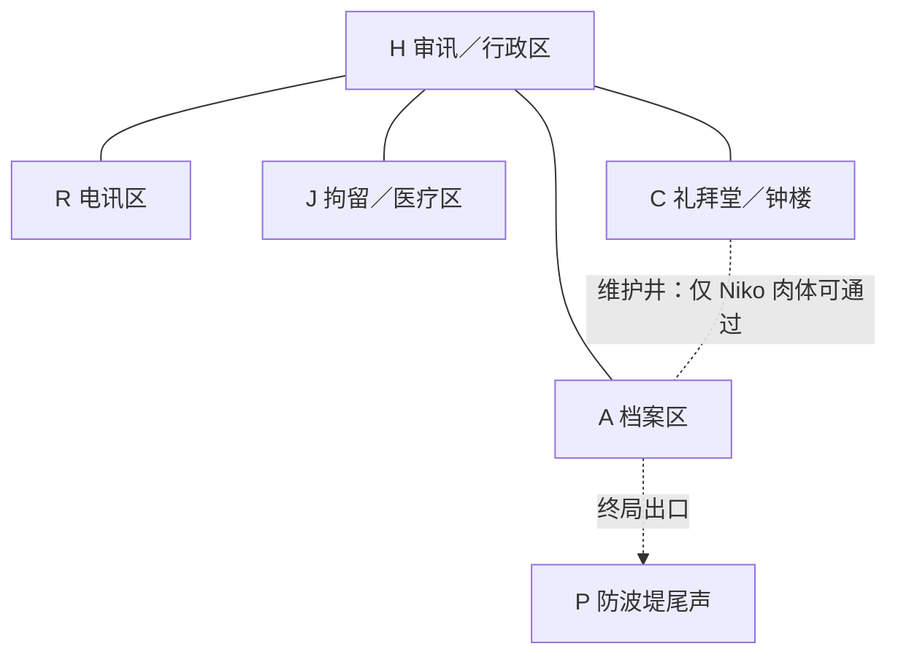
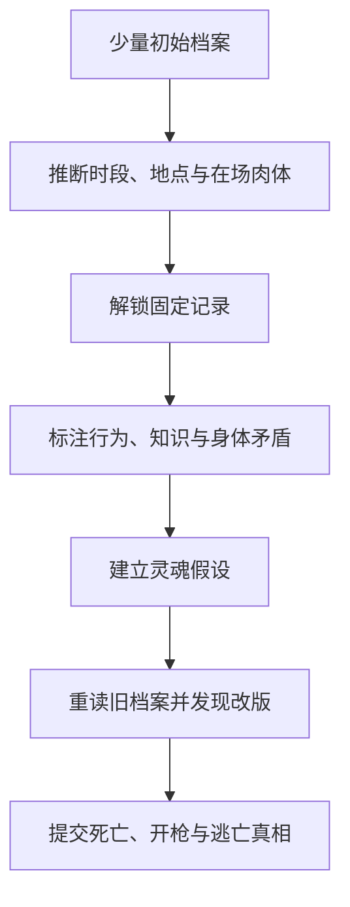

# 《黑潮钟》完整游戏策划 v1.0

> 文档性质：当前确定方案的统一基线  
> 游戏类型：固定故事、非线性档案调查、静态叙事推理  
> 核心结构：七声钟 × 七具肉体 × 七个灵魂 × 五个主地点  
> 当前状态：世界观、核心真相、交换规则、人物意志、证据结构与玩家流程已确定；精确地点矩阵留待下一轮单独设计。

---

## 0. 本版文档解决什么

本版将此前讨论中已经确定的内容合并成一份可继续开发的总策划，并正式采用以下复杂度边界：

- 游戏始终是类《Type Help》的**固定故事推理**，不是实时身份策略，也不是分支叙事。
- 玩家不能改变过去，只能通过正确推断解锁固定档案，还原已经发生的真相。
- 正式采用**五个主地点**。
- 每个钟后时段内，每具肉体只能处于一个地点、参与一场主要事件。
- 人物只能在钟声边界移动；时段内部不存在多地点位移。
- “灵魂—肉体占据矩阵”已经确定。
- “肉体—地点矩阵”尚未确定，下一轮将以本文件规则为约束单独编排。
- 此前的逐分钟多地点路线表不再作为正式设定。

---

# 一、项目定义

## 1.1 一句话概念

1928 年，亚得里亚海虚构自由港圣维拉，一座封闭的旧检疫海关站在黑潮夜响起七次警钟。七个人的灵魂随钟声在七具肉体之间轮转；其中一人暗中改动了轮转圆环，企图盗走一具年轻身体并让另一个灵魂替自己死去。

玩家面对的不是“谁杀了海关专员”，而是：

> 被枪杀的是谁的肉体，死去的是谁的灵魂，开枪者以为自己杀的是谁，而真正的凶手又借谁的身体离开了现场？

## 1.2 类型承诺

《黑潮钟》是以下类型的结合：

- 叙事推理（Narrative Deduction）
- 静态推理 / 信息拼图（Static Deduction）
- 数据库悬疑（Database Mystery）
- 非线性调查（Nonlinear Investigation）

它不是：

- 实时潜行或身份策略游戏；
- 玩家操纵灵魂跳转路线的沙盒；
- 多结局道德选择游戏；
- 依赖随机生成的推理游戏；
- 以口癖匹配为主的“人物标签数独”。

故事发展完全固定。玩家改变的是自己掌握信息的顺序，不是历史本身。

## 1.3 核心体验

玩家最初把数据库中的“身体姓名”理解为“人物姓名”。

随着矛盾累积，玩家逐步意识到：

```text
数据库正确识别了肉体，
但它从未承诺识别肉体里的灵魂。
```

核心快感由三个阶段构成：

1. **不安**：一个人做出不符合年龄、地位、技能或情报边界的行为。
2. **改写规则**：玩家发现不是证词全面撒谎，而是“身体姓名”不等于“行动意志”。
3. **二次还原**：玩家用灵魂交换规则重新解释此前所有记录，并发现有人又修改了交换规则。

## 1.4 玩家最终必须回答的问题

最终答卷至少包括：

1. 七个灵魂在七声钟后的肉体位置。
2. 原始七人圆环的顺序。
3. 哪一声钟后，谁改动了活字版框。
4. 哪具肉体被排除出后续轮转，并成为锚点。
5. Verri 肉体被枪杀时，里面是谁的灵魂。
6. 开枪的是哪一个灵魂，当时使用哪具肉体。
7. 开枪者以为自己杀的是谁。
8. 真正的 Verri 灵魂最终借哪具肉体逃离。
9. 哪些旧案行为共同造成了当夜的谋杀，而不只是“谁扣动扳机”。

---

# 二、成熟作品提供的设计原则

## 2.1 《Type Help》：信息解锁必须形成推理链

采用要点：

- 玩家通过已知信息推导新的“时间—地点—肉体”组合。
- 正确查询解锁一小块新资料，新资料又生成下一组可验证假设。
- 进度不能主要依赖穷举所有组合。
- 故事理解本身就是谜题，不是解谜后的奖励。

参考：[Zarf 对《Type Help》的设计分析](https://blog.zarfhome.com/2025/02/type-help)

## 2.2 《奥伯拉丁的回归》：作者真相顺序与玩家发现顺序分离

采用要点：

- 作者必须先建立唯一、完整、无矛盾的客观真相表。
- 玩家看到的文件顺序可以非线性，但客观事件不能因揭示顺序变化。
- 每个重要结论应由多种不同性质的证据交叉确认。

参考：[Lucas Pope 谈《Return of the Obra Dinn》的制作](https://www.gamedeveloper.com/business/road-to-the-igf-lucas-pope-s-i-return-of-the-obra-dinn-i-)

## 2.3 《金偶像谜案》：局部场景必须服务宏观因果

每个场景同时承担三项任务：

- 解答一个局部问题；
- 推进一个跨场景的长期谜团；
- 揭露人物欲望、关系或错误认知。

参考：[The Case of the Golden Idol 设计分析](https://www.gamedeveloper.com/design/case-of-the-golden-idol)

## 2.4 《伊芙琳·哈德卡斯尔的七次死亡》：时间与空间必须先于台词

采用要点：

- 身份置换故事必须先完成客观时间、地点和身体行动表。
- 不能先写戏剧性场面，再事后强行解释人物如何到场。
- 身体限制、交通时间和信息获得顺序必须可审计。

参考：[洛杉矶公共图书馆对 Stuart Turton 的访谈](https://www.lapl.org/news-stories/articles/interview-author-stuart-turton)

## 2.5 《无人生还》：封闭群像依赖公开身份与隐藏罪责的冲突

采用要点：

- 七个人都具有清晰、可快速识别的社会身份。
- 每个人都与旧案有关，但罪责性质和程度不同。
- 所有人都有隐瞒真相的动机，却不应都想做同一件事。

参考：[Agatha Christie 官方《And Then There Were None》页面](https://www.agathachristie.com/stories/and-then-there-were-none)

## 2.6 《Overboard!》：人物行为来自知识、信念、恐惧与信任

采用要点：

- 作者表不仅记录人物“知道什么”，还必须记录人物“误以为什么”。
- 行为必须从当时的局部认知推出，不能只为服务最终反转。
- 心理主要通过代价高昂的选择、沉默、保护对象和风险偏好呈现。

参考：[《Overboard!》行为设计分析](https://www.gamedeveloper.com/design/how-get-away-murder-overboard)

---

# 三、世界与案件

## 3.1 时间与地点

- 年代：1928 年。
- 地区：亚得里亚海虚构自由港“圣维拉”。
- 主要舞台：建在离岸防波堤上的旧检疫海关站。
- 天候：黑潮、暴雨、海水倒灌，通往城内的堤道关闭。
- 当夜时段：22:00 至 23:00，共七次警钟，每十分钟一次。
- 七人因不同理由被困在同一封闭建筑群内。

## 3.2 五年前的旧案

五年前，同一地点在一次黑潮中发生死亡事件。被拘留的移民、码头工人与政治嫌疑人因水门封闭而无法撤离。

七人与旧案的关系如下：

| 人物 | 当年的行为 | 想隐藏或纠正的部分 |
|---|---|---|
| Augusto Verri | 下令关闭水门，保护走私与非法拘押记录 | 想毁掉全部旧案证据，并避免承担责任 |
| Ilija Kovač | 亲手锁死水门 | 想证明自己服从的是错误情报，而非故意杀人 |
| Dr. Livia Moretti | 伪造死因和死亡登记；可能对一名垂死者实施安乐死 | 愿承认造假，但不愿让 Niko 再被牺牲 |
| Mara Vuković | 在强迫下错误翻译幸存者证词 | 想公开真相，却想毁掉证明自己参与伪证的原稿 |
| Klara Weiss | 未将完整求救电报发往大陆，并曾向警方提供地下组织信息 | 想把证据发给大陆报社，弥补沉默造成的死亡 |
| Mateo Rius | 印刷死者姓名和证言，后秘密设计灵魂契约 | 想让证词无法随证人死亡而消失 |
| Niko Petrović | 当时是少年幸存者，失去家人 | 想让所有涉案成年人付出代价，也不完全信任 Mateo |

旧案不是简单的“一个恶人杀死所有人”。它是一条分散责任链：

```text
命令 → 执行 → 医疗伪造 → 翻译歪曲 → 通讯沉默 → 证据地下化 → 幸存者复仇
```

这条责任链是当夜每个人“心怀鬼胎”的根源。

## 3.3 当夜的表面案件

第七声钟后出现三个结果：

- Augusto Verri 的肉体在封闭的电讯区内中枪死亡。
- Niko Petrović 的肉体失踪，并从防波堤方向留下逃离痕迹。
- 一封以 Mara 名义签署的电报被发往大陆，证明 Mateo 并非旧案主谋。

表面谜题是：

> 谁杀了 Verri？Mateo 是否利用骚乱逃亡？Niko 又去了哪里？

## 3.4 固定的完整真相

最终真相已经确定：

- 尸体的**肉体身份**是 Verri。
- 死亡的**灵魂身份**是 Niko。
- 直接开枪者是 Kovač 的灵魂，并且第七声后已经回到 Kovač 自己的肉体。
- Kovač 以为 Verri 的灵魂也已经回到 Verri 肉体，因此将其射杀。
- Verri 的灵魂在第四声后进入 Niko 肉体，并通过改动轮转版框使该身体成为锚点。
- 第七声后，Verri 仍在 Niko 肉体内，并借少年的外貌与体能逃向防波堤。
- Mateo 是原始灵魂契约的创造者，但 Verri 劫持并改造了契约。
- Mara 发现的是原始圆环；她向 Kovač 传递了一个过度简化、后来已过时的结论。
- 所以直接扣动扳机的是 Kovač，但谋杀的因果责任由 Verri 的篡改、Mara 的不完整情报、Kovač 的武断判断和旧案积累共同构成。

---

# 四、时间系统：七声钟

## 4.1 时间标记

| 标记 | 客观时间 | 定义 |
|---|---:|---|
| B0 | 22:00 前 | 序幕，所有灵魂仍在自己肉体中 |
| B1 | 22:00–22:10 | 第一声后状态 |
| B2 | 22:10–22:20 | 第二声后状态 |
| B3 | 22:20–22:30 | 第三声后状态 |
| B4 | 22:30–22:40 | 第四声后状态；核心机制正式揭示，Verri 改版 |
| B5 | 22:40–22:50 | 第五声后状态；各方开始按错误或局部规则行动 |
| B6 | 22:50–23:00 | 第六声后状态；局部回归制造错误确信 |
| B7 | 23:00 后 | 第七声后的终局稳定状态与命案现场 |

## 4.2 钟声边界的统一规则

每次钟声是唯一允许发生全局状态变化的边界：

1. 钟响，活字版框按照当前排列驱动灵魂跳转。
2. 各灵魂在新肉体中恢复意识，并立刻知道“这不是自己的身体”。
3. 水密门在极短过渡期解除锁定。
4. 每具肉体最多沿地图移动一条相邻边。
5. 水密门重新封闭，该肉体在下一个时段内固定于新的主地点。

## 4.3 时段内唯一地点原则

这是正式硬规则：

> 两声钟之间，每具肉体只能处于一个主地点。

具体约束：

- 一具肉体每个时段只有一个起点兼终点地点。
- 一具肉体每个时段只进入一个主要记录。
- 时段内部不发生“先去 A，再去 B，最后到 C”的路线。
- 时段内部不通过走廊制造额外目击、掉落物或中途对话。
- 地点变化只发生在钟声边界，并且最多跨越一条相邻边。
- 远程电报、传声管或有线电话必须明确标为“远程交互”，不构成第二个物理在场地点。

这个限制使每个时段保持接近《婆罗洲的红珍珠》的可读性：

```text
一个时段 + 一具肉体 = 一个地点 + 一场主要行为
```

## 4.4 物品移动规则

- 物品若未被携带，持续留在原地点。
- 物品只能随肉体在钟声边界移动。
- 边界期间不允许把同一物品转交多次。
- 时段内发生的交付，只会改变接收者下一个钟声边界可以携带什么。
- 机械记录必须能区分“物品在地点”“物品由某具肉体携带”两种状态。

---

# 五、空间系统：五个主地点

## 5.1 地点总表

| 代码 | 主地点 | 功能定位 | 主要证据类型 | 戏剧功能 |
|---|---|---|---|---|
| H | 审讯／行政区 | 值班台、审讯室、保险柜、身份档案 | 口供、通行记录、钥匙、旧案命令 | 权力、审问、公开对质 |
| R | 电讯区 | 无线电室、发报台、封闭信号间 | 电报码、发送日志、线路状态、枪击终局 | 对外传播、信息截断、终局命案 |
| J | 拘留／医疗区 | 拘留室、诊疗台、药柜 | 伤势、药品、指纹、身体限制、囚犯证词 | 身体客观性、照护与牺牲 |
| A | 档案区 | 死亡登记、翻译原稿、地下印刷物、旧版框 | 文书层次、字模、删改痕迹、旧案证据 | 历史真相、原始圆环证明 |
| C | 礼拜堂／钟楼 | 警钟、活字轮转版框、忏悔室、维护井 | 钟声记录、版框排列、机械痕迹 | 超自然机制、规则篡改 |

## 5.2 非主地点

防波堤码头 P 只作为终局出口和尾声证据地点：

- 它不是常规查询地点。
- 正常时段不安排多人在此发生主要事件。
- 只有终局逃离痕迹、船只记录或目击信息指向此处。

这样主游戏始终维持五地点规模，不因终局出口扩大组合数。

## 5.3 地点邻接关系



## 5.4 特殊空间规则

- H 是唯一公共枢纽，与其余四个主地点相邻。
- C 与 A 之间存在狭窄维护井。
- 维护井能否通过由**肉体条件**决定，而不是灵魂技能决定：Niko 的年轻、瘦小肉体可以通过；Verri 的年长肉体无法通过。
- 知道维护井位置属于**灵魂知识**：原本主要由 Niko 知道。
- 因此“知道路线”和“能穿过路线”是两种不同证据。
- A 到 P 的出口只在终局水位改变后形成，不作为普通时段的常规移动边。

## 5.5 尚未填写的地点矩阵

正式的“七身体 × 七时段”地点矩阵必须在下一轮完成。填写时必须满足：

1. 每格只有一个地点。
2. 相邻时段的地点必须相邻，或保持不变。
3. 每个地点每时段容纳的人数应产生有效交互，而不是平均分配。
4. B4 时，Niko 肉体必须能够接触 C 的活字版框。
5. B7 时，Verri 肉体与 Kovač 肉体必须能在 R 形成枪击事件。
6. Verri 灵魂使用 Niko 肉体的逃离路径必须从 C／A 方向合理通向 P。
7. 所有物证必须能由地点留存或由肉体在钟声边界携带到达。

在矩阵完成前，不确定任何角色每一声钟的具体地点。

---

# 六、灵魂与肉体的客观规则

## 6.1 数量守恒

- 七具肉体，七个灵魂。
- 任意时刻保持一一对应。
- 不存在无魂肉体、双魂共体或额外第八灵魂。
- 灵魂跳转不是时间旅行，也不会复制意识。

## 6.2 灵魂携带什么

- 自传式记忆；
- 语言、口音、修辞习惯；
- 学习所得的专业技能；
- 对其他人的关系、感情与偏见；
- 当前目标与未完成的计划；
- 对刚刚发生事件的认知。

## 6.3 肉体携带什么

- 年龄、外貌、声带与公开身份；
- 体力、身高、伤势、疾病、药物影响；
- 惯用手的生理熟练度与肌肉限制；
- 感官条件，例如近视、耳鸣、色觉；
- 指纹、血型、法律身份；
- 可被他人识别和信任的社会地位。

## 6.4 技能与身体限制

专业知识属于灵魂，但执行结果受肉体限制。

例子：

- Klara 的灵魂知道如何发送高速电码，但进入有关节炎的肉体后会出现节奏失误。
- Niko 的灵魂知道维护井路线，但进入 Verri 的肉体后无法钻过狭窄入口。
- Verri 的灵魂知道保险柜密码；进入 Niko 身体后仍能开锁，但必须适应不同手型。
- Livia 的灵魂能判断药物，却不能让一具失血身体恢复体力。

## 6.5 灵魂不能获得什么

- 不能自动读取肉体原主的记忆。
- 不能因为使用某具身体就知道其私密关系。
- 不能完美模仿原主的语言、动作和专业判断。
- 不能消除肉体的伤势、醉酒、疲劳或年龄限制。

## 6.6 当事人的直接认知

每个灵魂在第一次跳转后都能立即确认：

> “我不在自己的身体里。”

但他们并不知道：

- 是否所有七人都受影响；
- 灵魂按何种顺序轮转；
- 下一声会去哪里；
- 是否能够回到原身；
- 谁掌握完整规则；
- 活字版框能否被人为修改。

因此角色不会愚蠢地长期否认明显换身，但也不会在第一声后立刻形成完整共识。

---

# 七、七名人物

## 7.1 Mara Vuković——法庭译员／玩家视角核心

**公开身份**

- 熟悉多种南欧语言与法律措辞。
- 曾为海关和法院提供翻译。
- 看似谨慎、克制、善于准确复述他人的话。

**旧案秘密**

- 在 Verri 的强迫下，将幸存者证词译成较轻的“误闯禁区”。
- 保留了一份真正译文，但也想销毁能证明自己参与伪证的初稿。

**当夜意志**

- 让旧案真相被公开。
- 避免自己成为替罪羊。
- 保护 Klara 的对外发报机会。
- 在“完整真相”和“自我保存”之间反复摇摆。

**关键错误**

- 第四声后得到原始圆环，并把它当作仍持续有效的规则。
- 第五声后只向 Kovač 传递“第七声应使所有人回归”的简化结论。
- 她说的不是谎言，而是已经过时的真话。

## 7.2 Mateo Rius——加泰罗尼亚无政府主义者／排字工

**公开身份**

- 被拘押的外国政治嫌疑人。
- 会排版、印刷、密码化传单和工人组织暗号。

**旧案秘密**

- 收集并印刷死者姓名。
- 为避免证言随证人死亡而消失，设计了最初的七名灵魂契约。
- 契约未获得所有参与者充分知情同意。

**当夜意志**

- 让证据进入公共领域，哪怕有人因此牺牲。
- 阻止 Verri 销毁死亡名册。
- 不愿承认自己的“保存证言”同样把他人当作工具。

**心理矛盾**

- 他反对国家把人变成编号，却亲手设计了把人的身体变成载体的机制。

## 7.3 Augusto Verri——海关专员／主要对手

**公开身份**

- 掌握海关、拘押与出港权力。
- 年长、体力衰退，但仍具有制度威慑力。

**旧案秘密**

- 下令关闭水门并销毁走私、非法拘押和死亡证据。
- 从没收的 Mateo 材料中掌握契约的大部分规则。

**当夜意志**

- 毁掉旧案证据。
- 让自己的灵魂进入 Niko 的年轻身体并永久留下。
- 让被所有人憎恨的“Verri 肉体”替自己承受报复。
- 借少年身份离开圣维拉。

**核心信念**

> 每个人在真相与自保之间，最终都会选择自保。

这使他能够利用 Mara 的羞耻、Kovač 的责任感和 Livia 对 Niko 的保护欲。

## 7.4 Dr. Livia Moretti——检疫医生

**公开身份**

- 医生，熟悉伤势、药品和尸检。
- Niko 的保护者与非正式监护人。

**旧案秘密**

- 在威胁下修改死亡原因。
- 可能曾为一名无法获救的受害者实施安乐死。

**当夜意志**

- 找回真正的死亡登记。
- 不惜暴露自己造假，也要保护 Niko 的身体与生命。
- 拒绝 Mateo 以“保存更大真相”为理由牺牲 Niko。

**核心盲点**

- 她过度把 Niko 当作需要保护的孩子，没有正视 Niko 自己的复仇意志。

## 7.5 Ilija Kovač——港警队长

**公开身份**

- 负责封锁建筑、持有配枪与门禁权。
- 服从秩序、厌恶政治混乱。

**旧案秘密**

- 亲手锁死水门。
- 当年相信 Verri 所称“门后没有平民”，但后来知道这是假话。

**当夜意志**

- 阻止 Verri 毁证和逃亡。
- 避免军方借骚乱接管港口。
- 希望通过亲手惩罚 Verri 证明自己不再服从错误命令。

**致命错误**

- 第六声后自己如预期回到原身，于是把局部验证误当成全局验证。
- 他不知道 Niko 已被排除出圆环，也不知道 Verri 灵魂仍在 Niko 肉体里。
- 他绝不会有意杀死 Niko，但最终正是他杀死了 Niko 的灵魂。

## 7.6 Klara Weiss——无线电报务员

**公开身份**

- 掌握电报码、线路节奏和大陆媒体频段。
- 做事快，语言短促，习惯“收到—重复—确认”。

**旧案秘密**

- 曾被迫向警方提供地下组织信息，间接导致 Mateo 被捕。
- 在旧案当夜未能将完整求救信息发出。

**当夜意志**

- 把死亡名册和责任链发往大陆报社。
- 拒绝再因沉默造成无辜者死亡。
- 对 Mateo 有愧疚，但不接受其牺牲式政治逻辑。

**核心风险**

- 她的技能非常显眼，是玩家早期识别灵魂错位的主要线索，也因此容易被 Verri 伪造和利用。

## 7.7 Niko Petrović——十七岁钟楼学徒

**公开身份**

- 熟悉建筑维护井、钟楼机械和防波堤结构。
- 年轻、瘦小，能够进入其他肉体不能通过的空间。

**旧案秘密**

- 五年前失去家人，是少数幸存者之一。
- 曾看到 Mateo 的契约草稿，但不相信成年人会正确使用它。

**当夜意志**

- 让所有涉案成年人付出代价，而不是只推出 Verri 一个替罪羊。
- 拒绝被 Livia 永远当作被动受害者。
- 对 Mateo、Mara、Kovač 都有不同程度的不信任。

**悲剧位置**

- 他的肉体是 Verri 想盗取的目标。
- 他的灵魂最终被留在 Verri 肉体中，并死于 Kovač 的错误枪击。

---

# 八、人物是否相识与社会关系

## 8.1 相识尺度

七人**全部认识彼此的脸和公开身份**，原因是圣维拉港规模小、旧案牵连广、当夜又处于同一封闭设施。

但他们并非全部私交密切：

- 每个人只深入了解 2–3 人。
- 他们知道别人的社会角色，不知道其全部罪责。
- 这使“身体身份”具有社会意义，又保留对语言、记忆和私密称呼的推理空间。

如果七人互不相识，灵魂换身后的社会伪装失去意义；如果七人彼此完全了解，早期谜底会过快公开。当前方案取中间尺度。

## 8.2 关系网络

| 关系 | 表面关系 | 隐藏张力 |
|---|---|---|
| Verri—Kovač | 上级与执法者 | Kovač 曾执行 Verri 的致命命令，现想亲手反抗 |
| Verri—Mara | 雇主与译员 | Verri 以身份与把柄强迫 Mara 伪译 |
| Mateo—Klara | 地下出版者与报务员 | Klara 的情报曾导致 Mateo 被捕 |
| Livia—Niko | 医生与受保护少年 | Livia 的保护逐渐成为控制，Niko 不接受被替代发言 |
| Mateo—Niko | 证言保存者与幸存者 | Mateo 把牺牲合理化，Niko 不愿再成为材料 |
| Mara—Klara | 语言与通讯上的合作关系 | 两人都想公开真相，却都隐瞒自己的旧案责任 |
| Livia—Kovač | 医生与警察 | 两人都声称“当时别无选择”，但彼此不接受对方的理由 |

## 8.3 “每个人都心怀鬼胎”的具体含义

“心怀鬼胎”不是所有人都想杀人，而是每个人都有：

- 一个公开目标；
- 一个不能公开的旧案责任；
- 一个当夜必须保护的人或事物；
- 一个会使其误判他人的错误信念；
- 一条即使真相受损也不愿跨越的底线。

这样人物行为不会只是为了制造谜题，而会从意志冲突中自然产生。

---

# 九、七人圆环与客观占据表

## 9.1 原始圆环

Mateo 设计的原始轮转顺序为：

```text
Mara → Klara → Livia → Niko → Mateo → Kovač → Verri → Mara
```

含义：每声钟响后，某具肉体中的灵魂移动到圆环中的下一具肉体。

前四声钟都遵循原始圆环。

## 9.2 第四声后的篡改

第四声后：

- Verri 的灵魂进入 Niko 的肉体。
- Niko 的肉体能够进入 C 与 A 之间的狭窄维护井，并接近活字版框。
- Verri 从正在生效的版框中移除 Niko 名字对应的活字，使 Niko 肉体成为不再轮转的锚点。
- 他将其余六个名字重新排列为：

```text
Mara → Klara → Livia → Verri → Mateo → Kovač → Mara
```

结果：

- Verri 灵魂从 B4 起持续留在 Niko 肉体内。
- Niko 灵魂仍随其当时所在肉体进入修改后的六人环，最终被送入 Verri 肉体。
- 部分人会提前回到原身，制造“原始圆环仍然有效”的假象。

## 9.3 完整灵魂占据矩阵

下表纵轴为**肉体**，横轴为钟后状态，单元格为其中的**灵魂**。

| 肉体 \ 时段 | B1 | B2 | B3 | B4 | B5 | B6 | B7 |
|---|---|---|---|---|---|---|---|
| Mara 肉体 | Verri | Kovač | Mateo | Niko | Klara | Mara | Livia |
| Klara 肉体 | Mara | Verri | Kovač | Mateo | Niko | Klara | Mara |
| Livia 肉体 | Klara | Mara | Verri | Kovač | Mateo | Niko | Klara |
| Niko 肉体 | Livia | Klara | Mara | Verri | Verri | Verri | Verri |
| Mateo 肉体 | Niko | Livia | Klara | Mara | Livia | Kovač | Mateo |
| Kovač 肉体 | Mateo | Niko | Livia | Klara | Mara | Livia | Kovač |
| Verri 肉体 | Kovač | Mateo | Niko | Livia | Kovač | Mateo | Niko |

## 9.4 B7 的终局状态

| 灵魂 | 最终肉体 | 状态 |
|---|---|---|
| Verri | Niko 肉体 | 存活并逃离 |
| Niko | Verri 肉体 | 被 Kovač 枪杀 |
| Mateo | Mateo 肉体 | 回归原身 |
| Kovač | Kovač 肉体 | 回归原身并开枪 |
| Mara | Klara 肉体 | 留在三人循环中 |
| Klara | Livia 肉体 | 留在三人循环中 |
| Livia | Mara 肉体 | 留在三人循环中 |

七声钟结束后，契约停止驱动，以上状态成为当夜结束时的固定结果。

---

# 十、情报公开与角色共识

## 10.1 核心原则

灵魂穿越不应一开始就是公共常识，也不能让所有人长时间否认亲身体验。

采用结构：

```text
个人确信 → 局部互证 → 七人范围共识 → 原始顺序的少数人知识 → 篡改后的认知分裂
```

## 10.2 分阶段知识表

| 阶段 | 角色客观经历 | 当事人共识 | 精确规则掌握者 |
|---|---|---|---|
| B0 前 | 尚未跳转 | 无公共共识 | Mateo 知原始规则；Verri 知大部分规则及可能的改版方式；Klara 只知“钟声保险”存在 |
| B1 | 每个人第一次进入错误肉体 | 每人只确信自己换身，不知范围 | Mateo、Verri 保持信息优势 |
| B2 | 局部人物互相验证私密知识和技能 | 相遇的小组确认至少多人交换 | 仍无全体精确圆环共识 |
| B3 | 证据覆盖七具肉体 | “七人全部受影响”成为公共事实 | 精确顺序仍未公开 |
| B4 | Mara 在 Mateo 肉体中发现原始排字证据 | 所有人知道钟声驱动交换，但未必知道顺序 | Mateo、Verri、Mara 掌握原始圆环；Verri 同时改版，只有他知道新圆环 |
| B5 | 部分回归趋势出现 | 各人开始依据不同版本行动 | Mara 只把“第七声应全员回归”告诉 Kovač，没有交付完整表格 |
| B6 | Mara、Klara 等局部结果与预期部分吻合 | 一些人误以为原始规则仍有效 | Mara 察觉规则被改，但警告未成功送达；Kovač 只知道简化结论 |
| B7 | 命案与逃离发生 | 幸存者才可能重建完整篡改 | 玩家最终比绝大多数角色更完整地还原真相 |

## 10.3 “七人圆环何时公开”的正式答案

- “七人全部参与交换”在 B3 后成为公共事实。
- “原始七人圆环的精确顺序”从未在 B7 前向所有人公开。
- B4 后精确知道原始顺序的只有 Mateo、Verri 和 Mara。
- Kovač 得到的只是 Mara 的二手简化结论，不掌握完整圆环表。
- 改动后的六人环在命案前只有 Verri 知道。

因此不再使用“其他人仍以为七人圆环保持不变”这种过宽表述。更准确的说法是：

> Mara 暂时误以为原始圆环仍有效；Kovač 又把 Mara 的简化判断误当成可靠全局结论。其他人只拥有各自的局部猜测。

---

# 十一、固定事件骨架

本节只规定每一时段必须完成的叙事功能，不提前填写尚未确定的具体地点分配。

## B0：旧秩序

- 七人以自己的身体出现。
- 建立年龄、社会身份、伤势、技能和关系基线。
- 黑潮封闭建筑，Verri 试图接管旧案材料。
- Mateo 暗示钟声是“证言保险”，但不解释契约。

## B1：第一次错位

- 每个灵魂确认自己进入错误肉体。
- 玩家只看到三类轻微软矛盾：用手习惯、语言节奏、错误的社会称呼。
- 记录仍将说话者标为肉体姓名，使玩家倾向于解释为压力、伪装或秘密技能。

## B2：局部互证

- 两组人物用私密关系、专业技能或只有上一时段亲历者才知道的信息确认换身。
- 出现第一对“互为位移”的证据：A 肉体表现出 B 灵魂特征，B 肉体表现出 A 灵魂的连续意图。
- Verri 开始寻找活字版框的位置。

## B3：七人范围成立

- 七具肉体都出现无法用普通伪装解释的证据。
- “七人全部受影响”成为角色层面的公共事实。
- 玩家仍不应知道完整轮转顺序。
- Niko 的维护路线知识和 Verri 的制度知识分别出现在错误肉体中，为 B4 做准备。

## B4：规则揭示与同步篡改

- Mara 的灵魂进入 Mateo 肉体。
- 她利用排字技能留下的手部操作痕迹，找到原始七人圆环校样。
- 留言面向“第四声后使用这双手的人”，正式向玩家揭示：七具肉体、七个灵魂、每声前移一格。
- 同时，Verri 灵魂进入 Niko 肉体，接近正在生效的活字版框并改动它。
- Mara 看到的是**原始校样**，不是改动后的**实时版框**。

建议的揭示文本：

> 七具肉体，七个意志。钟每响一次，灵魂依版框向前一格。校样只能证明它原来如何排列；要知道下一声会发生什么，去看仍在钟下运转的那一版。

该文本揭示机制，同时公平提示“原始证据可能过时”。

## B5：错误规则开始支配行为

- Mara 根据原始校样计算出第七声的理想回归。
- 她无法把完整表传给 Kovač，只传出“第七声应全部回到原身”。
- Verri 以 Niko 肉体利用维护权限移动证据、制造逃离准备。
- Livia 发现 Niko 的肉体里表现出 Verri 的知识与冷酷目标，却尚不能证明锚定已发生。

## B6：局部正确制造全局错误

- Mara 提前回到自己肉体，意识到实际排列与原始计算不符。
- Klara 也出现表面正常回归，使“旧圆环仍有效”更具欺骗性。
- Kovač 尚未回归，但根据 Mara 的简化信息准备在第七声后拘捕或击毙 Verri。
- Mara 尝试发出“版框已改、不要按肉体开枪”的警告，但线路、地点或身份信任链使警告失败。

## B7：替换式谋杀

- Kovač 灵魂回到自己的肉体，验证了自己最关心的那一项预测。
- 他看见 Verri 肉体正急切取走最终证据；实际是 Niko 想保护并公开证据，但 Kovač 把这个动作理解为 Verri 正在销毁或劫走证据。
- Kovač 推断 Verri 灵魂也已回归，于是开枪。
- 实际上 Verri 肉体中是 Niko 灵魂。
- Verri 灵魂仍在 Niko 肉体内，并从档案区方向逃向防波堤。
- 最终电报发出，但签名、打字技能和发送者的身体身份彼此错位，为玩家留下最后一层证据。

---

# 十二、前期自相矛盾系统

## 12.1 矛盾设计目标

前期矛盾必须满足两件事：

1. 单条证据可以被普通原因解释。
2. 两至三条跨身体、跨时段证据组合后，只剩灵魂交换一种统一解释。

玩家应经历：

```text
“他可能隐瞒技能”
→ “两个人为什么同时表现成对方？”
→ “知识、意图与身体限制发生了系统性分离。”
```

## 12.2 第一层：可被普通解释的软矛盾

例子：

- 年轻的 Niko 肉体准确知道 Verri 保险柜的双重密码。
- Verri 肉体试图钻入维护井，却因年龄和体型失败，同时准确说出 Niko 才知道的暗扣位置。
- Mara 肉体在桌面无意识敲出 Klara 的电报码节奏。
- Klara 肉体使用 Mara 才熟悉的法律方言纠正旧译文。
- 医生肉体不理解药柜分类，却记得港警内部口令。

单独解释可能包括：偷听、隐藏教育、胁迫、装病或事先串谋。

## 12.3 第二层：成对位移

灵魂特征不能只在一个错误身体中出现，必须形成互相排除普通解释的配对。

例：

| 记录一 | 记录二 | 组合结论 |
|---|---|---|
| Niko 肉体知道 Verri 的保险柜密码 | Verri 肉体知道 Niko 的维护路线和私人称呼 | 不是单向泄密，而是两套人格位置发生了变化 |
| Mara 肉体能发标准电码 | Klara 肉体能解释只有 Mara 掌握的法律歧义 | 技能和记忆分别随意志移动 |
| Livia 肉体表现出 Verri 的权力判断 | 另一肉体持续保护 Niko 并识别其旧伤 | 医生的保护意志已离开医生肉体 |

## 12.4 第三层：客观不可能

在正式揭示前，至少出现两项无法用“提前串供”解释的硬矛盾：

- 某具肉体准确复述另一地点在上一声钟后才发生的对话，而其原主不可能到场。
- 同一个未公开计划在三具不同肉体中连续推进，且行动之间存在明确因果交接。
- 一个灵魂使用不熟悉的肉体完成知识正确、动作笨拙的专业行为。
- 私密称呼和情感反应指向同一灵魂，但声线、指纹和伤势始终指向另一具肉体。

## 12.5 核心揭示时机

灵魂交换在游戏约 40% 处、对应 B4 正式揭示。

此前玩家应该已经能够提出灵魂假说，但不能得到系统确认；B4 不是凭空告诉玩家答案，而是把玩家已形成的解释升级为正式规则。

## 12.6 揭示后的谜题升级

揭示后不能继续只让玩家做身份匹配。问题应依次升级为：

1. 原始圆环是什么？
2. 哪些文件应按灵魂而非肉体重新阅读？
3. 谁比别人更早知道规则？
4. 谁改动了实时版框？
5. 哪具肉体被锚定？
6. 谁利用部分回归制造了错误确信？
7. 最终死亡和逃亡分别发生在谁的肉体与灵魂上？

---

# 十三、行为、心理与对话如何呈现

## 13.1 不使用全知内心独白

档案系统不直接记录“某人心想”。心理必须通过可观察行为体现：

- 他愿意为哪件事承担风险；
- 她先保护谁，再保护什么证据；
- 谁在可以说真话时选择沉默；
- 谁主动纠正对自己不利的错误；
- 谁毁掉能洗清自己、却会伤害他人的证据；
- 谁用错误身体重复推进同一个目标。

## 13.2 对话记录

对话用于呈现：

- 语言结构与专业词汇；
- 私密称呼和关系边界；
- 角色掌握的情报范围；
- 谎言、回避和错误信念；
- 灵魂的持续意志。

记录中的说话者始终按**肉体身份**标注。例如：

```text
[Niko Petrović]
把第三层账本拿来。Verri 从不把船名写在第一页。
```

系统没有说这是 Niko 的灵魂。它只确认发声肉体是 Niko。

## 13.3 可观察行为

行为记录用于分离“知道怎么做”和“肉体能否做到”：

- 正确判断机关，却因身体尺寸无法执行；
- 知道药物作用，却用不熟悉的手拿错工具；
- 熟悉枪械程序，却受伤势影响无法稳定瞄准；
- 认得电报码，却因关节或听力限制漏掉节拍。

## 13.4 私人文本

包括：

- 电报草稿；
- 翻译原稿与修订稿；
- 死亡登记；
- 排字校样与实时版框；
- 私人信件；
- 审讯摘要；
- 医疗记录。

私人文本能证明书写者的意图、用词和信息来源，但不自动等于客观真相。

## 13.5 机器与环境记录

包括：

- 水密门锁定状态；
- 钟声时刻；
- 无线电发送日志；
- 保险柜开闭；
- 版框拆动痕迹；
- 药柜、枪支和钥匙的封条；
- 防波堤出口状态。

这些记录构成高可信的时空骨架，但它们只识别肉体、物品或设备状态，不识别灵魂。

---

# 十四、证据系统

## 14.1 证据可信度层级

| 层级 | 证据类型 | 证明力 | 局限 |
|---|---|---|---|
| 高 | 门锁、钟时、身体伤势、指纹、机械日志、电报发送记录 | 确定身体、地点、时间与设备状态 | 通常不能识别灵魂和动机 |
| 中高 | 专业程序、独占知识、私密记忆、跨时段连续计划 | 强烈指向某个灵魂 | 可能被模仿或通过泄密获得，需交叉验证 |
| 中 | 证词、对话、书信、审讯记录 | 反映人物所知与所信 | 可撒谎、误解或被胁迫 |
| 辅助 | 口癖、情绪、姿态、称呼习惯 | 提供方向和气氛 | 绝不能单独作为身份结论 |

## 14.2 每个关键结论的证据三角

关键结论至少需要三类证据：

1. **正向指认**：某个灵魂独有的知识、关系或技能。
2. **排除证据**：该肉体原主不可能知道、做到或到场。
3. **因果连续**：同一目标在前后不同肉体中持续推进。

例如判定“B4 的 Niko 肉体中是 Verri 灵魂”：

- 正向：掌握 Verri 保险柜密码和权力计划。
- 排除：Niko 此前无机会获知实时版框的控制方式。
- 连续：B3 某具身体开始寻找版框，B4 Niko 肉体继续同一计划并改版。

## 14.3 证据标签

玩家可给文件或句子添加标签：

- `身体限制`
- `灵魂技能`
- `独占知识`
- `关系记忆`
- `连续意图`
- `机械事实`
- `证词／可能撒谎`
- `规则原件`
- `规则已过时`

## 14.4 红鲱鱼原则

- 红鲱鱼必须来自人物真实动机，不得无缘无故设置。
- 隐藏技能可以解释一条软矛盾，但不能解释全部成对证据。
- 口癖可以被伪装；错误的生理限制不能被伪装。
- 所有误导在终局都必须获得人物层面的解释。

---

# 十五、玩家查询与解锁循环

## 15.1 基本查询键

玩家查询一份档案时输入或选择：

```text
钟声／时段 + 主地点 + 在场肉体
```

例如：

```text
B3 + 档案区 + Mara 肉体、Mateo 肉体
```

灵魂身份从不作为查询键，也不写进文件名。

## 15.2 为什么查询的是肉体

- 摄像、门禁、证词与机械记录都只能识别外貌或法律身份。
- 玩家前期自然把肉体姓名当成人物姓名。
- 核心揭示后，同一套档案无需改写，只需要重新解释。

这实现了本作的基本叙事原则：

> 系统不撒谎；系统只让玩家误解“姓名”这个字段代表什么。

## 15.3 核心流程



## 15.4 玩家笔记界面

建议保留三层笔记：

1. **身体地点表**：某时段某具肉体位于哪个主地点。
2. **灵魂假设表**：某具肉体内可能是谁的灵魂。
3. **证据板**：语言、技能、记忆、意图、物证与规则文件。

系统可以自动记录玩家已解锁的事实，但不自动替玩家作出灵魂结论。

## 15.5 避免让玩家手填 49 个身份格

玩家不应机械填写七乘七的全部格子。

采用分阶段解题：

- B1–B3：只要求确认 6–8 个关键灵魂错位。
- B4：玩家拼出原始七人圆环后，系统自动演算 B1–B4 占据表。
- B5–B7：玩家识别“改版时刻、被锚定肉体、改版者”后，系统演算后续占据。
- 终局：玩家提交替换式谋杀的语义答案，而不是重复抄表。

## 15.6 错误反馈

错误推断不只显示“错误”，而提供维度反馈：

- 与身体限制冲突；
- 与已确认的地点唯一性冲突；
- 该灵魂不可能知道此信息；
- 该假设不能解释前一时段的连续意图；
- 你使用的是原始校样，但当前版框可能已被修改。

反馈不能直接暴露正确灵魂。

---

# 十六、内容规模与节奏

## 16.1 主流程规模

- 七具肉体。
- 七个钟后状态。
- 五个主地点。
- 约 32–35 份核心档案。
- 约 4–6 份可选背景或人物档案。
- 总档案量约 36–42 份。
- 预计通关时长：3–5 小时。

每个时段并不需要覆盖五个地点的全部组合。建议每时段形成 4–5 份有效场景档案，部分地点可空置或由单人形成物证场景。

## 16.2 节奏百分比

| 游戏进度 | 叙事与推理功能 |
|---:|---|
| 0–15% | 建立人物基线、旧案气氛和一个可被普通解释的软矛盾 |
| 15–35% | 出现成对错位、知识越界和连续意图 |
| 35–42% | 玩家可以自行提出灵魂交换假说 |
| 约 42% | B4 以原始校样正式揭示机制 |
| 42–70% | 重读旧档案、拼出原始七人圆环 |
| 70–90% | 发现实时版框已改，重建各人动机与错误信念 |
| 90–100% | 识别灵魂受害者、开枪者、误杀逻辑与逃亡者 |

## 16.3 每份核心档案的最低职责

每份核心档案至少完成两项：

- 提供一个地点／时间／肉体事实；
- 提供一个灵魂指纹；
- 推进某个持续意图；
- 更新一段人物关系；
- 解锁下一份档案；
- 纠正一个旧假设；
- 暗示原始规则与实时规则的区别。

仅用于气氛、没有推理价值的文本应控制在可选档案中。

---

# 十七、技术与数据设计

## 17.1 部署方式

- 纯静态网页。
- GitHub Pages 托管。
- HTML / CSS / JavaScript 或轻量前端框架。
- JSON 存储剧情与解锁关系。
- `localStorage` 保存进度。
- 提供存档导出／导入。
- 不需要后端、账号或服务器隐藏答案。

单人推理游戏的全部数据会被下载到浏览器；本项目不以防作弊为设计目标。

## 17.2 玩家可见档案结构

```json
{
  "id": "B3_A_MARA_MATEO",
  "bell": "B3",
  "location": "A",
  "bodies": ["mara", "mateo"],
  "transcript": [],
  "actions": [],
  "evidenceTags": [],
  "unlocks": []
}
```

## 17.3 作者真相结构

```json
{
  "bell": "B4",
  "body": "niko",
  "soul": "verri",
  "location": "C",
  "intent": "alter_live_frame",
  "knowledge": ["original_ring", "frame_editing"],
  "carriedItems": ["name_slug_tool"],
  "leftItems": ["scratched_niko_slug"]
}
```

作者字段不直接发送到玩家界面逻辑中，或在构建时拆分为不可直接显示的校验数据。

## 17.4 自动校验器应检查

- 每个时段每具肉体只有一个地点。
- 每个时段每个灵魂只占据一具肉体。
- 每个时段每具肉体只容纳一个灵魂。
- 相邻时段地点移动不超过一条地图边。
- 物品不会无来源地跨地点出现。
- 角色不会在获得情报前使用该情报。
- 每个关键结论至少存在一个可达的证据三角。
- 不存在必须先解锁自己才能解锁的循环依赖。

---

# 十八、作者制作表与工作顺序

## 18.1 必备母表

| 母表 | 当前状态 | 用途 |
|---|---|---|
| A. 七声钟灵魂占据表 | 已确定 | 确认每具肉体中的真实灵魂 |
| B. 七声钟客观地点表 | 待下一轮 | 确认每具肉体每时段唯一地点与交互对象 |
| C. 知识／误信表 | 框架已确定，待逐格填写 | 防止角色使用尚未获得的信息 |
| D. 物品状态表 | 规则已确定，待随地点表填写 | 跟踪枪、钥匙、校样、活字、死亡登记等 |
| E. 证据依赖图 | 框架已确定，待档案化 | 控制解锁节奏，避免穷举与软锁 |
| F. 玩家发现顺序表 | 待档案完成后设计 | 区分客观时间与玩家阅读顺序 |

## 18.2 下一阶段正确顺序

1. 在五地点地图上填写 7×7 客观地点矩阵。
2. 为每个时段确定 4–5 个场景组和单人场景。
3. 为每具肉体记录当时灵魂、目标、已知、误信和携带物。
4. 检查所有移动只发生在钟声边界。
5. 写每场景的客观行为，不先写修辞性台词。
6. 为关键结论布置证据三角。
7. 最后把客观行为转成对话、动作记录、机器日志和私人文本。
8. 设计非线性解锁顺序与提示系统。

---

# 十九、已确定、待确定与不再采用

## 19.1 已确定

- 固定故事、类《Type Help》的档案推理形式。
- 七具肉体与七个灵魂始终等量、一一对应。
- 七声钟每十分钟一次。
- 五个主地点。
- 每个时段每具肉体只能在一个地点。
- 灵魂与肉体属性分离规则。
- 七名人物的身份、旧案责任、当夜意志与关键关系。
- 原始七人圆环。
- B4 的篡改方式与改动后六人环。
- 完整灵魂占据矩阵。
- B7 的替换式谋杀、误杀者与逃亡者。
- 灵魂机制约 40% 时正式揭示。
- “七人全部受影响”与“精确圆环公开”分属不同情报层级。
- 查询维度为时段、地点和在场肉体。
- 对话与机器记录只识别肉体，不直接识别灵魂。

## 19.2 待下一轮确定

- 7×7 客观地点矩阵。
- 每个时段的具体场景分组与交互对象。
- 枪、版框工具、钥匙、死亡登记、翻译原稿等物品的逐时段位置。
- 每份档案的精确解锁条件。
- B6 警告失败的具体空间与通讯因果。
- B7 电讯区枪击现场的门锁、视线与物证细节。
- 最终电报由谁实际操作、是否在 B6 排入发送队列、为何到 B7 才完成发送。
- 最终档案数量与提示强度的试玩校准。

## 19.3 正式不再采用

以下旧想法仅保留为探索历史，不再进入当前正史：

- 两声钟之间按分钟安排人物经过多个地点。
- 同一肉体在一个时段内连续参与多场对话。
- 通过中途走廊目击来证明复杂路线。
- 七人一开始全部知道完整交换规则。
- 所有人在 B4 后都掌握原始圆环。
- 把“其他人仍以为七人圆环保持不变”作为统一群体认知。
- 玩家主动选择回应姓名或改变历史的分支机制。
- 巴塞罗那时间穿越章节、死者复活或额外灵魂。
- 由玩家规划换身路线的实时策略玩法。
- 单靠口癖确认灵魂身份。

此前文件《黑潮钟_七声钟客观地点表.md》中的逐分钟多地点路线为废案，不作为本版地点设计依据。下一版地点表必须从本文件的“五地点、钟声边界移动、时段内唯一地点”三项硬规则重新建立。

---

# 二十、项目核心表达

## 20.1 对外卖点句

> 七声钟，七具肉体，七个意志。档案记得每张脸，却不知道是谁在里面。

## 20.2 主题

本作的主题不是抽象的“灵魂是否存在”，而是：

> 当行为者、肉体身份、社会责任和主观意志可以分离时，我们究竟凭什么判断一个人应为哪件事负责？

## 20.3 设计底线

本作所有反转最终都必须回到可验证的行为因果：

- 灵魂决定一个人知道什么、想做什么。
- 肉体决定一个人能做什么、别人把他当成谁。
- 地点决定一个人有机会接触什么。
- 钟声决定这些条件何时重新组合。
- 人物的错误信念决定悲剧为何在唯一固定的结局中发生。

如果一个谜题不能同时尊重以上五项，就不应进入正式剧本。
