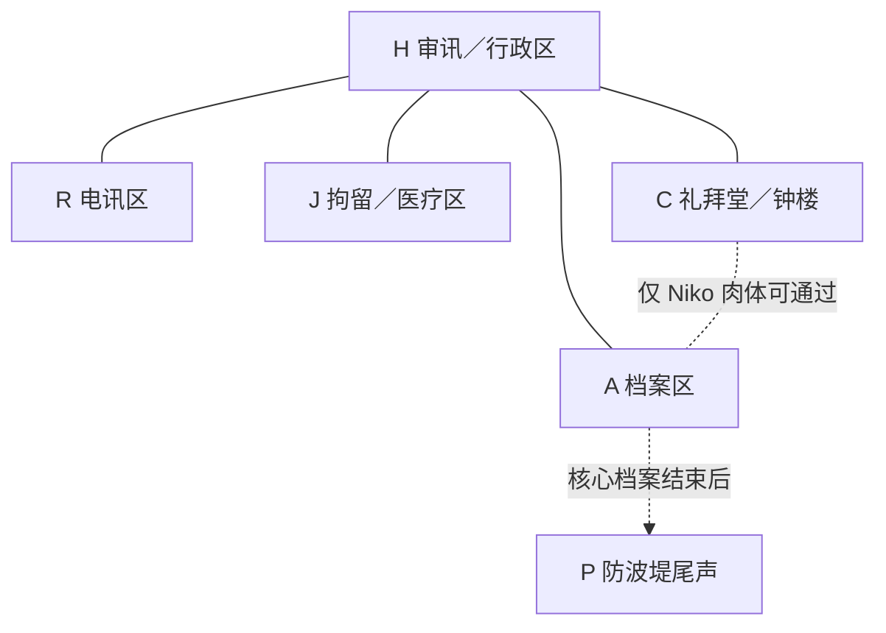

# 《黑潮钟》身体—时段—地点矩阵 v1.0

> 上位文档：《黑潮钟》完整游戏策划 v1.0  
> 本文用途：确定七具肉体在 B0–B7 的唯一地点、场景分组、边界移动、交互对象和关键物证路径  
> 设计目标：五个主地点；时段内不移动；每次钟声后最多移动一条相邻边；每具肉体每时段只参加一场主要物理事件

---

# 一、结论摘要

本矩阵采用“低位移、强对照”的布局：

- Klara 肉体全程固定在 R 电讯区。
- Livia 肉体全程固定在 J 拘留／医疗区。
- Niko 肉体前四声固定在 C 礼拜堂／钟楼，B5 起经专用维护井进入 A 档案区。
- Mara、Mateo、Kovač、Verri 四具肉体承担地点之间的证据运输与人员交互。
- 每个时段只有 4–5 个物理场景。
- 单个场景最多三具肉体，不出现四人以上的现场对话。
- B4 同时满足“Mara 发现原始圆环”和“Verri 修改实时版框”。
- B5 满足“Mara 向 Kovač 传递过度简化的回归结论”。
- B6 满足“Mara 与 Klara 提前回归、发现原始圆环已失效”。
- B7 满足“Kovač 肉体与 Verri 肉体进入 R，发生替换式谋杀”；Niko 肉体则留在 A，准备从非主地点 P 逃离。

这套矩阵将地点推理控制在可审计规模，同时保留灵魂身份、知识边界与物证流转的复杂度。

---

# 二、地点与移动规则

## 2.1 地点代码

| 代码 | 主地点 | 核心功能 |
|---|---|---|
| H | 审讯／行政区 | 公共枢纽、对质、武器与门禁管理 |
| R | 电讯区 | 无线电、发报台、信号间、终局枪击 |
| J | 拘留／医疗区 | 身体检查、拘押、药品、旧案医疗记录 |
| A | 档案区 | 死亡名册、译文、排字校样、地下印刷物 |
| C | 礼拜堂／钟楼 | 警钟、实时活字版框、维护机构 |

非主地点 P 为防波堤尾声出口，不进入常规身体矩阵。

## 2.2 邻接图



## 2.3 硬约束

1. 一个时段内，一具肉体只有一个地点。
2. 一个时段内，一具肉体只参加一场主要物理事件。
3. 地点改变只发生在钟声边界。
4. 一次边界移动最多跨越一条相邻边。
5. H 与 R、J、A、C 相邻。
6. C—A 维护井只有 Niko 肉体能够通过。
7. A—P 只在核心矩阵结束后的尾声使用。
8. 远程传声管或有线线路不构成第二个物理地点。
9. 空置地点可以留下机械日志，但不生成额外人物在场记录。

---

# 三、主身体地点矩阵

## 3.1 地点矩阵

下表纵轴是肉体，横轴是客观时段，单元格只表示肉体所在主地点。

| 肉体 \ 时段 | B0 钟前 | B1 | B2 | B3 | B4 | B5 | B6 | B7 |
|---|---|---|---|---|---|---|---|---|
| Mara 肉体 | H | A | A | A | H | R | R | H |
| Klara 肉体 | R | R | R | R | R | R | R | R |
| Livia 肉体 | J | J | J | J | J | J | J | J |
| Niko 肉体 | C | C | C | C | C | A | A | A |
| Mateo 肉体 | J | J | J | H | A | A | H | A |
| Kovač 肉体 | H | A | A | H | H | H | H | R |
| Verri 肉体 | H | H | A | H | H | H | H | R |

## 3.2 单具肉体路径

| 肉体 | 路径 | 地点变化次数 | 设计作用 |
|---|---|---:|---|
| Mara | H → A → A → A → H → R → R → H | 4 | 串联权力、档案、电讯三条证据线 |
| Klara | R → R → R → R → R → R → R → R | 0 | 形成固定电讯实验位，比较七个灵魂对同一设备的使用差异 |
| Livia | J → J → J → J → J → J → J → J | 0 | 形成固定身体实验位，持续记录药物、伤势和医疗知识错位 |
| Niko | C → C → C → C → C → A → A → A | 1 | 让 Verri 利用年轻肉体完成唯一的 C—A 特殊移动 |
| Mateo | J → J → J → H → A → A → H → A | 4 | 将拘留、公共确认、原始校样和终局档案串联 |
| Kovač | H → A → A → H → H → H → H → R | 3 | 让配枪始终随 Kovač 肉体流转，并在 B7 合理进入枪击现场 |
| Verri | H → H → A → H → H → H → H → R | 3 | 让受害肉体携带旧案证据，最终进入电讯区被误杀 |

七具肉体总计发生 15 次地点变化。B0–B7 共存在 49 次可发生移动的身体边界机会，实际移动率约为 30.6%。

这意味着玩家主要追踪“谁留在原地”，而不是持续计算复杂路线。

---

# 四、身体、灵魂与地点合并矩阵

格式为：

```text
地点 · 当前灵魂
```

| 肉体 \ 时段 | B1 | B2 | B3 | B4 | B5 | B6 | B7 |
|---|---|---|---|---|---|---|---|
| Mara 肉体 | A · Verri | A · Kovač | A · Mateo | H · Niko | R · Klara | R · Mara | H · Livia |
| Klara 肉体 | R · Mara | R · Verri | R · Kovač | R · Mateo | R · Niko | R · Klara | R · Mara |
| Livia 肉体 | J · Klara | J · Mara | J · Verri | J · Kovač | J · Mateo | J · Niko | J · Klara |
| Niko 肉体 | C · Livia | C · Klara | C · Mara | C · Verri | A · Verri | A · Verri | A · Verri |
| Mateo 肉体 | J · Niko | J · Livia | H · Klara | A · Mara | A · Livia | H · Kovač | A · Mateo |
| Kovač 肉体 | A · Mateo | A · Niko | H · Livia | H · Klara | H · Mara | H · Livia | R · Kovač |
| Verri 肉体 | H · Kovač | A · Mateo | H · Niko | H · Livia | H · Kovač | H · Mateo | R · Niko |

## 4.1 三条最重要的可视化轨迹

### Klara 肉体：同一电讯台上的七种意志

Klara 肉体始终在 R，但其中灵魂依次为：

```text
Mara → Verri → Kovač → Mateo → Niko → Klara → Mara
```

玩家可以在完全相同的设备、声线和物理环境下，观察不同灵魂的：

- 电报知识；
- 法律语言；
- 权力口令；
- 政治暗号；
- 对失踪亲人的反应；
- 对发送真相的不同态度。

这是一条最清晰的“灵魂变量、身体和地点恒定”实验线。

### Livia 肉体：同一医疗现场上的知识错位

Livia 肉体始终在 J，但其中灵魂依次为：

```text
Klara → Mara → Verri → Kovač → Mateo → Niko → Klara
```

J 的固定药柜、伤员和医疗记录能持续检验：

- 谁真的懂医学；
- 谁只是在使用医生的脸和权限；
- 谁知道旧案死因；
- 谁愿意救治、胁迫或牺牲同一个人。

### Niko 肉体：Verri 的锚点与逃生工具

Niko 肉体 B1–B4 固定在 C，B4 时 Verri 灵魂进入其中并修改实时版框；B5 后通过只有这具肉体能通行的维护井进入 A。

这条轨迹同时证明：

- 路线知识属于灵魂；
- 能否通过狭窄空间属于肉体；
- Verri 盗取的不只是年轻外貌，而是一条其他身体无法使用的逃生权限。

## 4.2 两具固定肉体为何不离开

Klara 与 Livia 肉体全程固定，不代表它们被超自然力量锚定。每一声后进入其中的灵魂都具有不同但成立的留守理由。

### Klara 肉体留在 R

| 时段 | 当前灵魂 | 留在 R 的理由 |
|---|---|---|
| B1 | Mara | 想利用电讯设备向外发送法律警告 |
| B2 | Verri | 想截断对外通讯，并预先破坏长句继电器 |
| B3 | Kovač | 想通过中央线路组织全站身份确认 |
| B4 | Mateo | 想把受害者名单编码发出 |
| B5 | Niko | 想与具有报务技能的 Klara 灵魂合作求援 |
| B6 | Klara | 回到原身后制作最终发送带 |
| B7 | Mara | 利用预置发送带完成法律证词发送 |

### Livia 肉体留在 J

| 时段 | 当前灵魂 | 留在 J 的理由 |
|---|---|---|
| B1 | Klara | 需要确认换身并照看同室的 Mateo 肉体 |
| B2 | Mara | 查阅旧案伤亡文件，并与 Livia 灵魂互证身份 |
| B3 | Verri | 利用医生权限取得镇静剂和真实死因索引 |
| B4 | Kovač | 检查旧案伤势与武器去向，误以为医生柜内留有备用枪 |
| B5 | Mateo | 寻找被伪造的死因，判断哪些证言尚能公开 |
| B6 | Niko | 通过自己的旧医疗记录和家属遗物证明身份 |
| B7 | Klara | 判断离开医疗区接收端无益，选择留在 J 监听发送结果并保全伤亡记录 |

因此，地点恒定是七个局部选择叠加的结果，而非额外的契约规则。玩家也能从不同灵魂“为什么都不愿离开同一地点”理解 R 与 J 的战略价值。

---

# 五、各时段场景分组

每一行是一场主要物理事件。括号内为作者可见的真实灵魂，玩家文件只显示肉体姓名。

## B0：钟前基线

| 地点 | 在场肉体 | 作者真相 | 场景职责 | 主要证据 |
|---|---|---|---|---|
| H | Mara、Kovač、Verri | 三人均为原主 | Verri 下令封站；Mara 解释拘押令；Kovač登记配枪 | 三人的正常语言、权力关系、Kovač枪套封条 |
| R | Klara | Klara 原主 | Klara 接收不完整的大陆电报并测试线路 | 正常摩尔斯节奏、报务员基线、发送队列状态 |
| J | Livia、Mateo | 两人均为原主 | Livia 检查被拘押的 Mateo | Livia 医疗程序、Mateo 排字伤痕、两人价值冲突 |
| C | Niko | Niko 原主 | Niko 校准七次警钟并进入维护井 | Niko 的身体尺寸、维护路线和钟楼知识基线 |
| A | 无人 | — | 暂时封存旧案材料 | 原始校样、死亡登记、译文仍在原位 |

## B1：第一次错位

| 地点 | 在场肉体 | 真实灵魂 | 主要行为 | 玩家获得的矛盾／证据 |
|---|---|---|---|---|
| A | Mara、Kovač | Verri、Mateo | Mara 肉体准确打开 Verri 私柜；Kovač 肉体辨认 Mateo 的排字暗记 | 社会权限和独占知识同时出现在错误身体；两人都刻意掩饰震惊 |
| R | Klara | Mara | 尝试发送法律警告，却不会完成 Klara 的高速发报程序 | Klara 肉体使用 Mara 的法律措辞，但出现非报务员式停顿 |
| J | Livia、Mateo | Klara、Niko | Livia 肉体无意识敲出摩尔斯节奏；Mateo 肉体认出 Niko 家属遗物 | 第一组成对软错位；仍可被解释为串供或隐藏技能 |
| C | Niko | Livia | 检查 Niko 肉体的旧伤和脉搏，留下专业包扎 | 少年肉体出现医生知识，但动作受短小手指影响 |
| H | Verri | Kovač | 使用港警内部口令要求开门，随后因 Verri 的呼吸问题中断 | Verri 肉体表现出警务程序与陌生身体限制 |

## B2：局部互证

| 地点 | 在场肉体 | 真实灵魂 | 主要行为 | 玩家获得的矛盾／证据 |
|---|---|---|---|---|
| A | Mara、Kovač、Verri | Kovač、Niko、Mateo | 三人围绕死亡名册冲突；Verri 肉体继续 Mateo 的排字工作，并把受害者名单副本藏进自己外套夹层 | 连续意图跨入 Verri 肉体；名单此后随 Verri 肉体移动 |
| R | Klara | Verri | 使用海关专员口令调取线路，并预先破坏传声线路的长句继电器 | Klara 肉体掌握 Verri 独占口令；B6 警告将因此只传出前半句 |
| J | Livia、Mateo | Mara、Livia | Mateo 肉体完成正确诊断；Livia 肉体纠正一份法律译文 | 医疗技能和翻译技能形成明确的双向位移 |
| C | Niko | Klara | 把钟声间隔听成电报码并发现七格重复节奏 | Klara 的听码能力出现在 Niko 肉体；提示钟与七格机制相关 |
| H | 无人 | — | 公共枢纽暂时空置 | 门锁日志证明 A、R、J、C 的肉体没有在时段内经过 H |

## B3：七人范围成为公共事实

| 地点 | 在场肉体 | 真实灵魂 | 主要行为 | 玩家获得的矛盾／证据 |
|---|---|---|---|---|
| A | Mara | Mateo | 将原始圆环校样与一段写给“第四声后使用 Mateo 双手之人”的说明藏入排字柜 | 为 B4 正式揭示做准备；证明同一计划跨身体延续 |
| R | Klara | Kovač | 启动全站传声线路，以港警验证问题要求各地点回应 | Kovač 的警务知识出现在 Klara 肉体；建立局部共识渠道 |
| J | Livia | Verri | 利用医生权限取走镇静剂，并查阅旧案真实死因索引 | Verri 的控制意图延续；医生身体的权限被他人利用 |
| C | Niko | Mara | 看见钟下活字版框的七个姓名，但不懂排字方向，只抄下镜像文字 | 玩家获得圆环视觉前兆；Mara 尚不能正确解释 |
| H | Mateo、Kovač、Verri | Klara、Livia、Niko | 三人通过中央线路与其他地点交换私密验证问题 | 七人都受影响成为角色公共事实；精确顺序仍未公开 |

说明：B3 的传声会议是远程交互。A、R、J、C 的肉体始终停留在各自地点；它们只通过固定线路听见或回应，不构成第二地点在场。

## B4：原始规则揭示与实时规则篡改

| 地点 | 在场肉体 | 真实灵魂 | 主要行为 | 玩家获得的矛盾／证据 |
|---|---|---|---|---|
| A | Mateo | Mara | 依 Mateo 留下的排字提示找到原始圆环校样，并第一次正确解释七格轮转 | 正式揭示灵魂交换；但校样只证明原始排列 |
| C | Niko | Verri | 从实时版框取下 Niko 名字活字，并重新排列其余六名；把 Niko 活字藏在衣物中 | 改版机械痕迹、缺失活字和 B5 后锚定现象；该记录延后解锁 |
| H | Mara、Kovač、Verri | Niko、Klara、Livia | Niko 与 Livia 以错误身体重逢；Klara 尝试恢复长句传声线路 | 情感关系随灵魂移动；Livia 首次直接观察 Niko 灵魂不在 Niko 肉体 |
| R | Klara | Mateo | 尝试把受害者名单编码，却缺乏 Klara 的专业发送技巧 | 目标连续但技能缺失；形成“知道要发什么，却不会发”的硬限制 |
| J | Livia | Kovač | 试图取用自己的配枪，发现枪始终随 Kovač 肉体留在 H | 灵魂拥有警务目标，但武器属于肉体携带状态 |

## B5：错误规则开始支配行动

| 地点 | 在场肉体 | 真实灵魂 | 主要行为 | 玩家获得的矛盾／证据 |
|---|---|---|---|---|
| H | Kovač、Verri | Mara、Kovač | Mara 向 Kovač 传达“第七声后应全部回到原身”的简化结论；没有交付完整表格 | Kovač 的致命错误信念获得清楚来源；配枪仍封在 Kovač 肉体枪套中 |
| R | Mara、Klara | Klara、Niko | Klara 灵魂提供发报技能，Niko 所在的 Klara 肉体提供报务员身份与设备权限，两人合作发送不完整警告 | 技能、社会身份和肉体权限必须组合；单独任何一人都无法完成 |
| A | Niko、Mateo | Verri、Livia | Verri 使用 Niko 肉体穿过 C—A 维护井；Livia 认出其行为与知识，却不愿伤害 Niko 的身体 | Verri 的灵魂正向指认证据；Livia 的保护欲成为 Verri 的防护层 |
| J | Livia | Mateo | Mateo 在医生肉体中读到被伪造的死因，却不能以自己的排字方法复制证据 | 揭露 Livia 旧案责任；知识、工具和社会可信度再次分离 |
| C | 无人 | — | 实时版框继续运转，Niko 活字缺失 | 空房机械日志证明锚定不是人物口供，而是客观结构变化 |

## B6：局部回归制造全局误判

| 地点 | 在场肉体 | 真实灵魂 | 主要行为 | 玩家获得的矛盾／证据 |
|---|---|---|---|---|
| R | Mara、Klara | Mara、Klara | 两人都提前回到原身，立刻意识到原始七人环已失效；Klara 制作发送带，Mara 写入法律签名与证词摘要 | “原始校样已过时”的决定性证据；发送带留在 Klara 肉体可控制的发报台 |
| H | Mateo、Kovač、Verri | Kovač、Livia、Mateo | Kovač 只听到线路传来的前半句“第七声你会回到自己的身体”；后半句“Verri 不会”被 B2 的继电器破坏截断 | 错误信息形成过程客观可查；Livia 仍在 Kovač 肉体内并保持枪套封条 |
| J | Livia | Niko | 从自己的旧医疗记录和家属遗物确认身份，试图警告他人不要攻击 Verri 肉体 | Niko 明确知道自身危险，但地点隔离使警告无法及时到达 R |
| A | Niko | Verri | 整理逃离路线、销毁部分副本，把缺失的 Niko 活字作为契约控制凭证携带 | Verri 灵魂持续锚定；Niko 肉体准备从 A 通向 P |
| C | 无人 | — | 版框留下拆卸划痕与六人格轮转痕迹 | 玩家可在后期用机械记录反推出新六人环 |

## B7：替换式谋杀与逃离

| 地点 | 在场肉体 | 真实灵魂 | 主要行为 | 玩家获得的终局证据 |
|---|---|---|---|---|
| R | Klara、Kovač、Verri | Mara、Kovač、Niko | Mara 到达预置发送带前，只需触发发送；Niko 用 Verri 肉体把外套夹层中的受害者名单送向发报台；Kovač 以为 Verri 已回归，开枪击中 Verri 肉体 | 枪属于 Kovač 肉体；死者肉体是 Verri、灵魂是 Niko；发送日志、枪套封条和名单夹层共同还原现场 |
| A | Niko、Mateo | Verri、Mateo | Mateo 回到自己肉体并认出 Verri 正使用 Niko 肉体；Verri 借年轻身体将 Mateo 锁在档案室内，随后从 A 的尾声出口离开 | 逃亡者灵魂是 Verri、肉体是 Niko；Niko 活字随逃亡身体消失 |
| J | Livia | Klara | Klara 在医生肉体中听见自己 B6 制作的发送带节奏，确认电报已完成 | 证明 B7 的发送不要求 Mara 灵魂掌握高速发报技能 |
| H | Mara | Livia | Livia 在 Mara 肉体中听到枪声并赶向 R，但水密门已再次锁定 | 解释保护 Niko 的 Livia 为何无法阻止枪击 |
| C | 无人 | — | 钟停止；版框不再驱动后续交换 | B7 占据状态固定，后续不会自动恢复原身 |

## B7 后的 P 尾声

P 不作为第六个主地点，也不增加新的可查询时段。

- 核心矩阵在 B7 的四组现场记录结束。
- Niko 肉体在 A 现场完成锁门与离开动作后，从不再受水密门约束的外侧出口脱离核心记录范围。
- 玩家只会在尾声证据中看到 P 的湿脚印、小艇缺失和掉落的 Niko 名字活字。
- P 证明逃离方向，但不产生另一场人物对话或新的灵魂变化。

---

# 六、钟声边界移动表

只列发生地点变化的肉体；未列者保持原地。

| 边界 | 移动 | 新进入肉体的灵魂 | 移动理由 | 携带或遗留 |
|---|---|---|---|---|
| B0 → B1 | Mara：H → A | Verri | 寻找旧案私柜与契约材料 | 使用 Verri 记忆打开私柜 |
| B0 → B1 | Kovač：H → A | Mateo | 接近自己隐藏的排字材料 | 配枪仍封在 Kovač 肉体枪套 |
| B1 → B2 | Verri：H → A | Mateo | 接续 B1 的排字计划 | 将受害者名单藏入 Verri 外套夹层 |
| B2 → B3 | Mateo：J → H | Klara | 使用中央传声设备建立多点确认 | 无重要物品移动 |
| B2 → B3 | Kovač：A → H | Livia | 寻找 Niko 与医疗援助 | 配枪继续随 Kovač 肉体移动 |
| B2 → B3 | Verri：A → H | Niko | 寻找 Livia并揭露旧案 | 外套夹层名单继续随 Verri 肉体移动 |
| B3 → B4 | Mara：A → H | Niko | 回应 Livia 和 Klara 的中央呼叫 | 无重要物品移动 |
| B3 → B4 | Mateo：H → A | Mara | 根据 Mateo 留言寻找原始校样 | 获得原始圆环知识，不带走校样原件 |
| B4 → B5 | Mara：H → R | Klara | 修复发报与长句线路 | 把线路故障诊断带到 R |
| B4 → B5 | Niko：C → A | Verri | 利用 Niko 肉体通过维护井；离开实时版框现场 | 携带被移除的 Niko 名字活字 |
| B5 → B6 | Mateo：A → H | Kovač | 接近自己的身体、配枪与公共枢纽 | 未携枪；枪仍在 Kovač 肉体上 |
| B6 → B7 | Mara：R → H | Livia | 前往公共枢纽寻找 Niko，试图组织医疗保护 | 离开发报台，未能进入 R 内部信号间 |
| B6 → B7 | Mateo：H → A | Mateo | 回到原身后取回契约与原始证据 | 到 A 后被 Verri 使用 Niko 肉体锁住 |
| B6 → B7 | Kovač：H → R | Kovač | 回到原身后执行对 Verri 的逮捕计划 | 获得一直随肉体保存的配枪 |
| B6 → B7 | Verri：H → R | Niko | 把 Verri 外套夹层中的受害者名单送到发报台 | 携带名单，外观被误认为 Verri 在劫证 |

## 6.1 没有“隐形中途事件”

以上边界移动只表达从旧地点到新地点，不生成可单独调查的走廊场景。

边界期间：

- 不允许额外会面；
- 不允许中途交换物品；
- 不允许留下决定性目击证词；
- 不允许在第三个地点短暂停留。

所有可推理行为必须发生在矩阵明确列出的主地点内。

---

# 七、关键物证路径

## 7.1 Kovač 的配枪

| 时段 | 所在肉体／地点 | 当前控制灵魂 | 状态 |
|---|---|---|---|
| B0 | Kovač 肉体／H | Kovač | 登记并加封枪套 |
| B1–B2 | Kovač 肉体／A | Mateo、Niko | 两人都未破坏封条 |
| B3–B6 | Kovač 肉体／H | Livia、Klara、Mara、Livia | 封条持续完整；不同灵魂选择不使用 |
| B7 | Kovač 肉体／R | Kovač | Kovač 回归后亲自破封并开枪 |

推理价值：枪从未“跟随 Kovač 灵魂”，它始终跟随 Kovač 肉体。这是肉体与灵魂分离规则的硬物证。

## 7.2 受害者名单副本

| 时段 | 路径 | 作用 |
|---|---|---|
| B0–B1 | A 排字柜 | 尚未被发现 |
| B2 | Mateo 灵魂使用 Verri 肉体，把名单藏入 Verri 外套夹层 | 形成跨五个时段的物证伏笔 |
| B3–B6 | 随 Verri 肉体在 H 保存 | 多个灵魂不知道夹层内容；B6 Mateo 再次进入 Verri 肉体并确认名单仍在 |
| B7 | Niko 灵魂进入 Verri 肉体，携名单 H → R | Niko 想把名单送入发报流程，Kovač 却把动作理解为 Verri 正在夺证 |

## 7.3 原始圆环校样

| 时段 | 所在地点 | 状态 |
|---|---|---|
| B0–B2 | A | 原始材料，无人完成解释 |
| B3 | A | Mateo 灵魂使用 Mara 肉体补写第四声提示 |
| B4 | A | Mara 灵魂使用 Mateo 肉体找到并解释校样 |
| B5–B7 | A | 原件仍在；它证明原始规则，但不能证明实时版框未被修改 |

## 7.4 Niko 名字活字

| 时段 | 所在位置 | 状态 |
|---|---|---|
| B0–B3 | C 实时版框 | 正常参与七人轮转 |
| B4 | Niko 肉体／C | Verri 取下并藏起，Niko 肉体成为锚点 |
| B5–B7 | Niko 肉体／A | 随 Verri 灵魂控制的年轻肉体保存 |
| 尾声 | P 防波堤 | 从逃亡者衣物中掉落，成为改版与逃亡者同一性的最终物证 |

## 7.5 电报发送带

| 时段 | 所在地点／肉体 | 状态 |
|---|---|---|
| B6 | R／Klara 肉体 | Klara 灵魂完成高速编码；Mara 以自己名义写入法律证明 |
| B7 | R／Klara 肉体 | Mara 灵魂进入 Klara 肉体，只需触发预置机械发送，不需要继承 Klara 技能 |

## 7.6 被截断的警告

| 时段 | 事件 | 因果 |
|---|---|---|
| B2 | Verri 灵魂使用 Klara 肉体破坏长句继电器 | 只让短口令稳定通过，便于日后控制信息长度 |
| B6 | Mara 与 Klara 从 R 发出警告 | H 只收到“第七声你会回到自己的身体” |
| B6 | 后半句“但 Verri 不会”丢失 | Kovač 得到局部真话，并据此形成致命全局误判 |

---

# 八、地点负载与复杂度

## 8.1 每时段各地点肉体数量

| 时段 | H | R | J | A | C | 合计 | 物理场景数 |
|---|---:|---:|---:|---:|---:|---:|---:|
| B0 | 3 | 1 | 2 | 0 | 1 | 7 | 4 |
| B1 | 1 | 1 | 2 | 2 | 1 | 7 | 5 |
| B2 | 0 | 1 | 2 | 3 | 1 | 7 | 4 |
| B3 | 3 | 1 | 1 | 1 | 1 | 7 | 5 |
| B4 | 3 | 1 | 1 | 1 | 1 | 7 | 5 |
| B5 | 2 | 2 | 1 | 2 | 0 | 7 | 4 |
| B6 | 3 | 2 | 1 | 1 | 0 | 7 | 4 |
| B7 | 1 | 3 | 1 | 2 | 0 | 7 | 4 |

## 8.2 复杂度结论

- 核心物理场景共 35 组。
- 每时段场景数为 4–5，不需要检查大量空组合。
- 最大同场肉体数为 3。
- 两具肉体零移动，一具肉体只移动一次。
- 没有任何肉体在一个时段出现两个地点。
- 没有任何移动跨越两条边。
- 后半程 C 空置，玩家可以把注意力从“谁在钟楼”转向“谁改过钟楼”。
- Klara 肉体固定 R、Livia 肉体固定 J，为玩家提供两个稳定的对照轴。
- 真正需要重点追踪的移动体只有 Mara、Mateo、Kovač、Verri 四具肉体。

相较逐分钟路线表，本版把空间复杂度从“连续路线重建”降为“离散状态重建”。玩家仍需推断身份和因果，但不必猜测人物在十分钟内是否先后经过多个房间。

---

# 九、客观一致性校验

## 9.1 邻接校验

- Mara：H↔A、H↔R，全部为合法相邻边。
- Klara：始终 R，无移动。
- Livia：始终 J，无移动。
- Niko：C→A，只使用 Niko 肉体专属维护井。
- Mateo：J→H→A→H→A，全部经过合法相邻边。
- Kovač：H→A→H→R，全部经过合法相邻边。
- Verri：H→A→H→R，全部经过合法相邻边。

## 9.2 灵魂守恒校验

- 每个 B1–B7 时段均为七灵魂、七肉体一一对应。
- B1–B4 完全服从原始七人圆环。
- B5–B7 服从移除 Niko 名字后的六人环与 Niko 肉体锚定规则。
- B7 的 Verri 肉体确为 Niko 灵魂，Kovač 肉体确为 Kovač 灵魂，Niko 肉体确为 Verri 灵魂。

## 9.3 终局可达性校验

- B6 时 Kovač 肉体位于 H，B7 可合法移动一边到 R。
- B6 时 Verri 肉体位于 H，B7 可合法移动一边到 R。
- B6 时 Klara 肉体已经位于 R，B7 无需移动即可操作预置发送带。
- B6 时 Niko 肉体位于 A，B7 保持 A，可在核心记录结束后使用尾声出口 P。
- 枪、名单、发送带和名字活字均具有连续物理路径。

## 9.4 人物意志校验

- Niko 灵魂进入 Verri 肉体后前往 R，是为了公开名单，不是毁证。
- Kovač 开枪，是因为他收到局部正确信息、自己确实回归原身，并把 Verri 肉体的取证动作理解为劫证。
- Livia 无法阻止枪击，不是因为放弃 Niko，而是因为 B7 进入 Mara 肉体后被水密门隔在 H。
- Mara 能完成最终发送，不是因为获得 Klara 的技能，而是 Klara 已在 B6 制作发送带。
- Verri 使用 Niko 肉体停留 A，是为了利用肉体专属路线和年轻体能逃往 P。
- Mateo 回到 A，是为了取回契约和原始证据，因此能成为唯一直接认出逃亡者灵魂的人。

---

# 十、玩家侧呈现建议

## 10.1 地点矩阵不直接全部展示

玩家开始时只看到空白时段表。每解锁一份记录，系统自动确认：

- 该时段；
- 该主地点；
- 确实在场的肉体。

玩家不需要手动填写已经由机器日志确认的身体地点，只需利用地点事实查询后续记录。

## 10.2 灵魂层在 B4 后开启

B4 前：

- 界面只显示肉体姓名。
- 玩家可以给档案添加“异常技能”“不可能情报”等标签。
- 系统不提供正式灵魂栏。

B4 后：

- 开启“灵魂假设”层。
- 玩家拼出原始圆环，系统自动计算 B1–B4。
- 玩家发现 B6 提前回归后，必须指出实时版框已被修改。
- 指出“Verri 改版 + Niko 肉体锚定”后，系统自动计算 B5–B7。

## 10.3 查询负担控制

由于每时段只有 4–5 个场景，推荐解锁方式是：

```text
已知时段 + 已知地点 + 两到三具候选肉体
```

而不是让玩家从五地点、七身体的全部组合中暴力枚举。

地点日志、门锁记录和上一份档案中的明确去向，至少应提前确定查询条件中的两项。

---

# 十一、下一步

地点矩阵确定后，下一阶段不再修改人物路线，而应依次完成：

1. 为 35 个物理场景分配正式档案编号。
2. 建立每场景的“角色已知／误信／目标”表。
3. 确定每场景公开哪些行为，隐藏哪些行为。
4. 为每个关键结论配置正向、排除、连续意图三类证据。
5. 设计 35 份档案的非线性解锁依赖图。
6. 最后才写完整对话与文本。

在进入下一步前，最值得优先审核的三项是：

- Klara 与 Livia 两具肉体全程固定是否过于整齐，还是能形成有价值的实验对照。
- B2 的 A 三人场景是否信息密度过高。
- B7 的 R 三人场景中，枪击、名单交付与发送带启动的先后顺序是否足够清楚。
